<!DOCTYPE html>
<html lang="en">
<head>
  <meta charset="UTF-8">
  <meta name="viewport" content="width=device-width, initial-scale=1.0">
  <title>Our Products | Gada Electronics</title>
  <meta name="description" content="Browse Gada Electronics' full range of industrial equipment — circuit breakers, transformers, switchgear — plus TVs, mobile phones, ACs, refrigerators, and home electronics from 25+ leading brands.">
  <link rel="canonical" href="https://www.gadaelectronics.com/products.html">

  <meta property="og:title" content="Our Products | Gada Electronics">
  <meta property="og:description" content="Circuit breakers, transformers, switchgear, cables, and automation equipment.">
  <meta property="og:image" content="assets/images/og/og-image.jpg">
  <meta property="og:type" content="website">

  <link rel="icon" href="assets/images/logo/favicon.ico">
  <link rel="preconnect" href="https://fonts.googleapis.com">
  <link rel="preconnect" href="https://fonts.gstatic.com" crossorigin>
  <link href="https://fonts.googleapis.com/css2?family=Sora:wght@400;500;600;700;800&family=Inter:wght@400;500;600;700&display=swap" rel="stylesheet">
  <link rel="stylesheet" href="https://cdnjs.cloudflare.com/ajax/libs/font-awesome/6.5.1/css/all.min.css">

  <link rel="stylesheet" href="css/main.css">
  <link rel="stylesheet" href="css/print.css" media="print">
</head>
<body class="page-products" data-nav-page="products">

  <a href="#main-content" class="skip-link">Skip to main content</a>

  <!-- ============================== HEADER ============================== -->
  <header class="site-header" data-js="header">
    <nav class="navbar" data-js="navbar">
      

        

        <ul class="navbar__links" role="menubar">
          <li role="none"><a href="index.html" data-nav-link="home" role="menuitem">Home</a></li>
          <li role="none"><a href="about.html" data-nav-link="about" role="menuitem">About</a></li>

          <li role="none" data-js="mega-menu-item" class="navbar__item--has-mega">
            <a href="products.html" data-nav-link="products" role="menuitem"
               data-js="mega-menu-trigger" aria-haspopup="true" aria-expanded="false" aria-controls="productsMegaMenu">
              Products <i class="fa-solid fa-chevron-down navbar__caret"></i>
            </a>
            

              <!-- Full mega-menu markup lives in partials/mega-menu.html -->
              

                
Mega menu content — see partials/mega-menu.html

              

            

          </li>

          <li role="none"><a href="industries.html" data-nav-link="industries" role="menuitem">Industries</a></li>
          <li role="none"><a href="services.html" data-nav-link="services" role="menuitem">Services</a></li>
          <li role="none"><a href="brands.html" data-nav-link="brands" role="menuitem">Brands</a></li>
          <li role="none"><a href="projects.html" data-nav-link="projects" role="menuitem">Projects</a></li>
          <li role="none"><a href="careers.html" data-nav-link="careers" role="menuitem">Careers</a></li>
          <li role="none"><a href="contact.html" data-nav-link="contact" role="menuitem">Contact</a></li>
        </ul>

        

          <a href="contact.html" class="btn btn--primary btn--sm navbar__cta">Get a Quote</a>
          <button type="button" class="navbar__mobile-trigger" data-js="mobile-menu-trigger" aria-label="Open menu" aria-expanded="false">
            
          </button>
        

      

    </nav>
  </header>

  <!-- Mobile Menu (off-canvas) -->
  

    <!-- Full mobile-menu markup lives in partials/mobile-menu.html -->
    
Mobile menu content — see partials/mobile-menu.html

  

  

  <main id="main-content" data-js="products-page">

    <section class="page-banner" style="background-image: url('assets/images/products/products-banner.jpg');">
      

        <nav class="breadcrumbs" aria-label="Breadcrumb">
          <a href="index.html">Home</a>
          <i class="fa-solid fa-chevron-right breadcrumbs__separator"></i>
          Products
        </nav>
        <h1 class="page-banner__title">Our Products</h1>
        
Industrial electrical equipment and automation gear, alongside TVs, mobile phones, ACs, refrigerators, and everyday home electronics.

      

    </section>

    <section class="section">
      

        <!-- ---------- Sidebar Filters ---------- -->
        <aside class="filters-sidebar" data-js="filters-sidebar" aria-label="Product filters">
          

            <h2 class="card__title" style="font-size: var(--fs-h5);">Filters</h2>
            <button type="button" class="filters-sidebar__clear" data-js="clear-filters">Clear All</button>
          

          

            
Shop

            

              

                <label><input type="radio" name="department" value="" checked> All Departments</label>
              

              

                <label><input type="radio" name="department" value="industrial"> Industrial &amp; Automation</label>
              

              

                <label><input type="radio" name="department" value="consumer"> Home &amp; Consumer Electronics</label>
              

            

          

          

            
Category

            

              

                <label><input type="checkbox" name="category" value="circuit-breakers"> Circuit Breakers</label>
                42
              

              

                <label><input type="checkbox" name="category" value="transformers"> Transformers</label>
                28
              

              

                <label><input type="checkbox" name="category" value="switchgear"> Switchgear</label>
                33
              

              

                <label><input type="checkbox" name="category" value="cables-wires"> Cables &amp; Wires</label>
                21
              

              

                <label><input type="checkbox" name="category" value="relays"> Relays &amp; Protection</label>
                17
              

              

                <label><input type="checkbox" name="category" value="panels"> Distribution Panels</label>
                19
              

              

                <label><input type="checkbox" name="category" value="televisions"> Televisions</label>
                24
              

              

                <label><input type="checkbox" name="category" value="mobile-phones"> Mobile Phones</label>
                36
              

              

                <label><input type="checkbox" name="category" value="air-conditioners"> Air Conditioners</label>
                18
              

              

                <label><input type="checkbox" name="category" value="refrigerators"> Refrigerators</label>
                15
              

              

                <label><input type="checkbox" name="category" value="home-appliances"> Home Appliances</label>
                22
              

              

                <label><input type="checkbox" name="category" value="gadgets-accessories"> Gadgets &amp; Accessories</label>
                29
              

              
<label><input type="checkbox" name="category" value="toasters"> Toasters</label>5

              
<label><input type="checkbox" name="category" value="air-fryers"> Air Fryers</label>5

              
<label><input type="checkbox" name="category" value="iron-press"> Iron &amp; Press</label>4

              
<label><input type="checkbox" name="category" value="microwaves"> Microwave Ovens</label>2

              
<label><input type="checkbox" name="category" value="mixers"> Mixer Grinders</label>2

              
<label><input type="checkbox" name="category" value="fans"> Fans</label>2

              
<label><input type="checkbox" name="category" value="laptops"> Laptops</label>2

              
<label><input type="checkbox" name="category" value="tablets"> Tablets</label>1

              
<label><input type="checkbox" name="category" value="audio"> Audio &amp; Headphones</label>3

            

          

          

            
Brand

            

              

                <label><input type="checkbox" name="brand" value="siemens"> Siemens</label>
                58
              

              

                <label><input type="checkbox" name="brand" value="schneider-electric"> Schneider Electric</label>
                47
              

              

                <label><input type="checkbox" name="brand" value="abb"> ABB</label>
                39
              

              

                <label><input type="checkbox" name="brand" value="legrand"> Legrand</label>
                28
              

              

                <label><input type="checkbox" name="brand" value="havells"> Havells</label>
                44
              

              

                <label><input type="checkbox" name="brand" value="samsung"> Samsung</label>
                33
              

              

                <label><input type="checkbox" name="brand" value="lg"> LG</label>
                27
              

              

                <label><input type="checkbox" name="brand" value="apple"> Apple</label>
                14
              

              

                <label><input type="checkbox" name="brand" value="sony"> Sony</label>
                19
              

              

                <label><input type="checkbox" name="brand" value="whirlpool"> Whirlpool</label>
                12
              

              
<label><input type="checkbox" name="brand" value="oneplus"> OnePlus</label>2

              
<label><input type="checkbox" name="brand" value="xiaomi"> Xiaomi</label>2

              
<label><input type="checkbox" name="brand" value="vivo"> Vivo</label>1

              
<label><input type="checkbox" name="brand" value="oppo"> OPPO</label>1

              
<label><input type="checkbox" name="brand" value="motorola"> Motorola</label>1

              
<label><input type="checkbox" name="brand" value="tcl"> TCL</label>2

              
<label><input type="checkbox" name="brand" value="daikin"> Daikin</label>2

              
<label><input type="checkbox" name="brand" value="voltas"> Voltas</label>1

              
<label><input type="checkbox" name="brand" value="blue-star"> Blue Star</label>1

              
<label><input type="checkbox" name="brand" value="haier"> Haier</label>1

              
<label><input type="checkbox" name="brand" value="bosch"> Bosch</label>2

              
<label><input type="checkbox" name="brand" value="ifb"> IFB</label>1

              
<label><input type="checkbox" name="brand" value="philips"> Philips</label>5

              
<label><input type="checkbox" name="brand" value="bajaj"> Bajaj</label>6

              
<label><input type="checkbox" name="brand" value="sony"> Sony</label>4

              
<label><input type="checkbox" name="brand" value="jbl"> JBL</label>1

              
<label><input type="checkbox" name="brand" value="dyson"> Dyson</label>1

              
<label><input type="checkbox" name="brand" value="google"> Google</label>1

              
<label><input type="checkbox" name="brand" value="realme"> Realme</label>1

              
<label><input type="checkbox" name="brand" value="poco"> POCO</label>1

              
<label><input type="checkbox" name="brand" value="nothing"> Nothing</label>1

              
<label><input type="checkbox" name="brand" value="honor"> Honor</label>1

              
<label><input type="checkbox" name="brand" value="hitachi"> Hitachi</label>1

              
<label><input type="checkbox" name="brand" value="godrej"> Godrej</label>1

              
<label><input type="checkbox" name="brand" value="panasonic"> Panasonic</label>1

              
<label><input type="checkbox" name="brand" value="prestige"> Prestige</label>1

              
<label><input type="checkbox" name="brand" value="usha"> Usha</label>2

              
<label><input type="checkbox" name="brand" value="inalsa"> Inalsa</label>1

            

          

          

            
Availability

            

              

                <label><input type="radio" name="availability" value=""> All</label>
              

              

                <label><input type="radio" name="availability" value="in-stock"> In Stock</label>
              

              

                <label><input type="radio" name="availability" value="pre-order"> Pre-Order</label>
              

              

                <label><input type="radio" name="availability" value="out-of-stock"> Out of Stock</label>
              

            

          

          

            
Price Range (₹)

            

              <label for="minPrice" class="u-sr-only">Minimum price</label>
              <input type="number" id="minPrice" class="form-control" placeholder="Min" min="0">
              —
              <label for="maxPrice" class="u-sr-only">Maximum price</label>
              <input type="number" id="maxPrice" class="form-control" placeholder="Max" min="0">
            

            <button type="button" class="btn btn--secondary btn--sm btn--full u-mt-4" data-js="apply-price-filter">Apply</button>
          

        </aside>

        <!-- ---------- Main Content ---------- -->
        

          <!-- Toolbar -->
          

            

              

                <label for="productSearch" class="u-sr-only">Search products</label>
                <i class="fa-solid fa-magnifying-glass search-input__icon"></i>
                <input type="search" id="productSearch" class="form-control" placeholder="Search products by name or SKU..." data-js="product-search">
                <button type="button" class="search-input__clear" aria-label="Clear search" data-js="product-search-clear"><i class="fa-solid fa-xmark"></i></button>
              

              111 Products
            

            

              <select class="form-control" data-js="product-sort" aria-label="Sort products">
                <option value="createdAt-desc">Newest First</option>
                <option value="price-asc">Price: Low to High</option>
                <option value="price-desc">Price: High to Low</option>
                <option value="name-asc">Name: A to Z</option>
                <option value="popularity-desc">Most Popular</option>
              </select>
              

                <button type="button" class="view-toggle__btn is-active" data-js="view-grid" aria-label="Grid view"><i class="fa-solid fa-grip"></i></button>
                <button type="button" class="view-toggle__btn" data-js="view-list" aria-label="List view"><i class="fa-solid fa-list"></i></button>
              

            

          

          <!-- Active Filter Chips -->
          

          <!-- Product Grid -->
          

            

              

                Bestseller
                

                  <button aria-label="Add to wishlist"><i class="fa-regular fa-heart"></i></button>
                  <button aria-label="Quick view"><i class="fa-solid fa-eye"></i></button>
                

                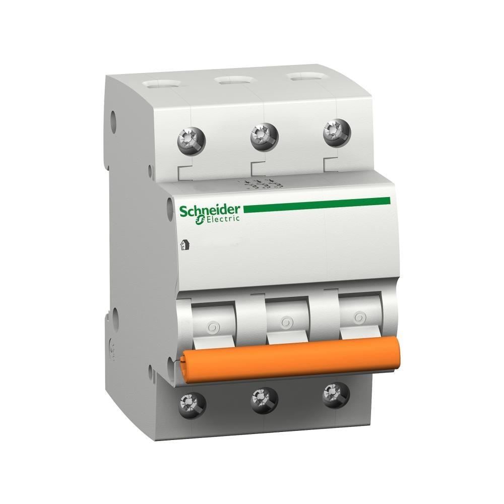
              

              

                
Siemens

                <h3 class="card__title"><a href="product-details.html?product=mcb-miniature-circuit-breaker-32a">MCB Circuit Breaker 32A</a></h3>
                
<i class="fa-solid fa-star"></i><i class="fa-solid fa-star"></i><i class="fa-solid fa-star"></i><i class="fa-solid fa-star"></i><i class="fa-solid fa-star-half-stroke"></i>

                
₹845

                

                  In Stock
                

              

            

            

              

                

                  <button aria-label="Add to wishlist"><i class="fa-regular fa-heart"></i></button>
                  <button aria-label="Quick view"><i class="fa-solid fa-eye"></i></button>
                

                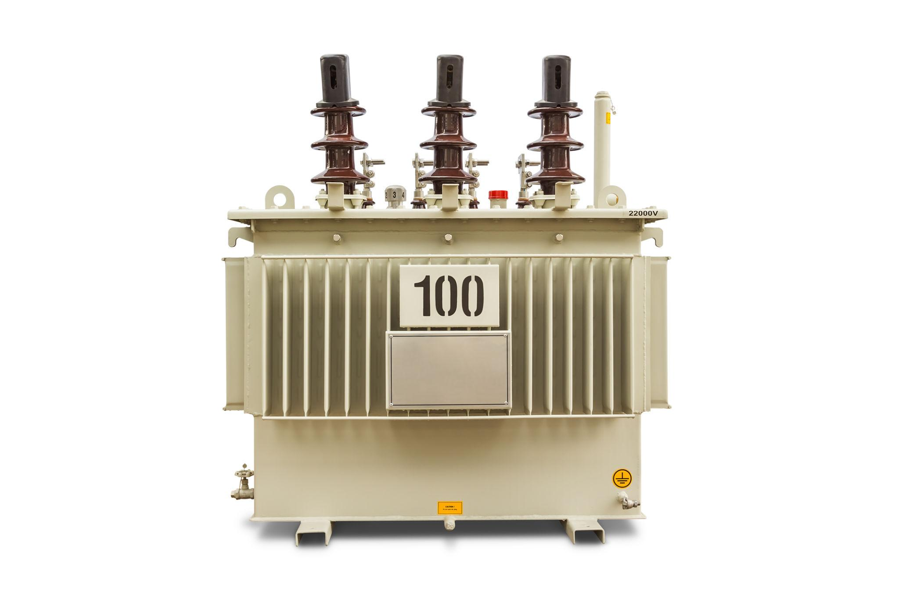
              

              

                
ABB

                <h3 class="card__title"><a href="product-details.html?product=distribution-transformer-100kva">Distribution Transformer 100kVA</a></h3>
                
<i class="fa-solid fa-star"></i><i class="fa-solid fa-star"></i><i class="fa-solid fa-star"></i><i class="fa-solid fa-star"></i><i class="fa-solid fa-star"></i>

                
₹2,84,000

                

                  In Stock
                

              

            

            

              

                New
                

                  <button aria-label="Add to wishlist"><i class="fa-regular fa-heart"></i></button>
                  <button aria-label="Quick view"><i class="fa-solid fa-eye"></i></button>
                

                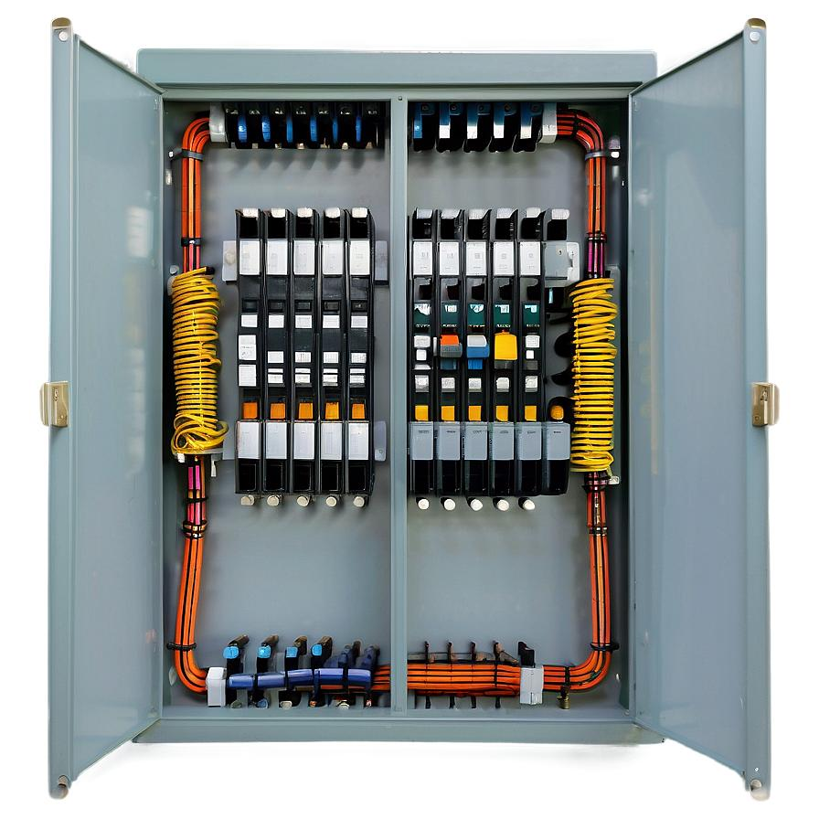
              

              

                
Schneider Electric

                <h3 class="card__title"><a href="product-details.html?product=smart-distribution-panel">Smart Distribution Panel</a></h3>
                
<i class="fa-solid fa-star"></i><i class="fa-solid fa-star"></i><i class="fa-solid fa-star"></i><i class="fa-solid fa-star"></i><i class="fa-solid fa-star-half-stroke"></i>

                
₹56,200

                

                  Pre-Order
                

              

            

            

              

                

                  <button aria-label="Add to wishlist"><i class="fa-regular fa-heart"></i></button>
                  <button aria-label="Quick view"><i class="fa-solid fa-eye"></i></button>
                

                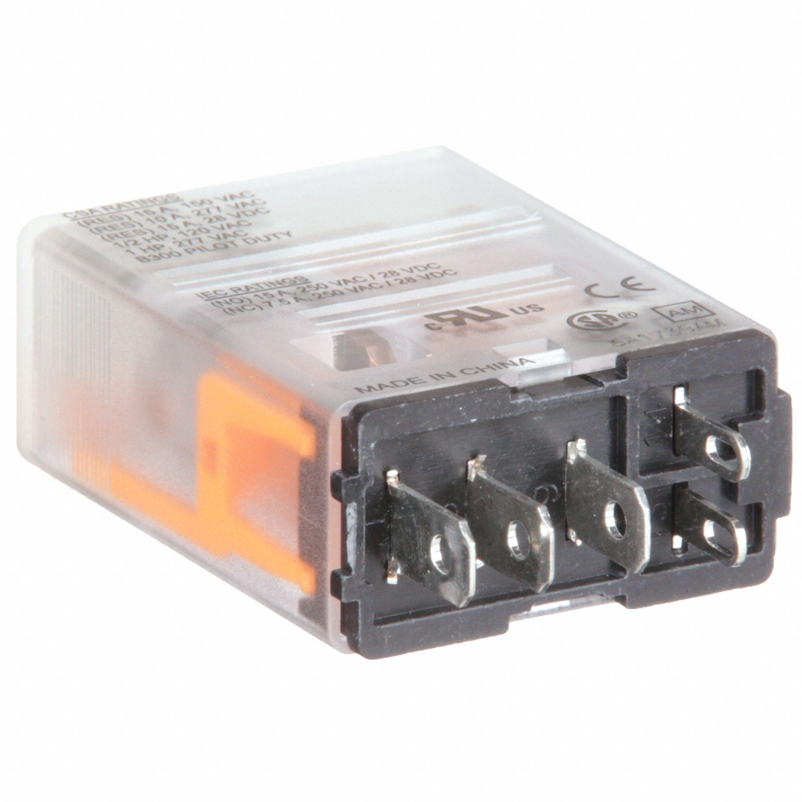
              

              

                
Legrand

                <h3 class="card__title"><a href="product-details.html?product=protection-relay-unit">Protection Relay Unit</a></h3>
                
<i class="fa-solid fa-star"></i><i class="fa-solid fa-star"></i><i class="fa-solid fa-star"></i><i class="fa-solid fa-star"></i>

                
₹12,400

                

                  In Stock
                

              

            

            

              

                

                  <button aria-label="Add to wishlist"><i class="fa-regular fa-heart"></i></button>
                  <button aria-label="Quick view"><i class="fa-solid fa-eye"></i></button>
                

                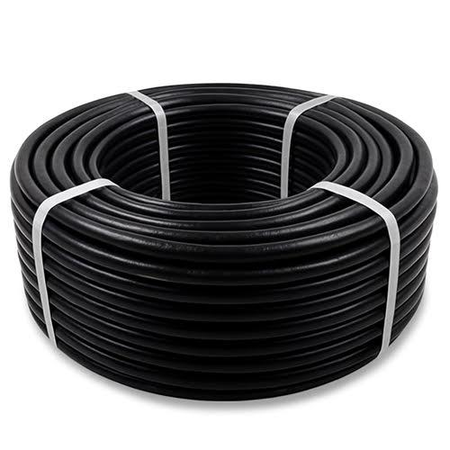
              

              

                
Polycab

                <h3 class="card__title"><a href="product-details.html?product=xlpe-armoured-cable">XLPE Armoured Cable (Per Meter)</a></h3>
                
<i class="fa-solid fa-star"></i><i class="fa-solid fa-star"></i><i class="fa-solid fa-star"></i><i class="fa-solid fa-star"></i><i class="fa-solid fa-star-half-stroke"></i>

                
₹185

                

                  In Stock
                

              

            

            

              

                

                  <button aria-label="Add to wishlist"><i class="fa-regular fa-heart"></i></button>
                  <button aria-label="Quick view"><i class="fa-solid fa-eye"></i></button>
                

                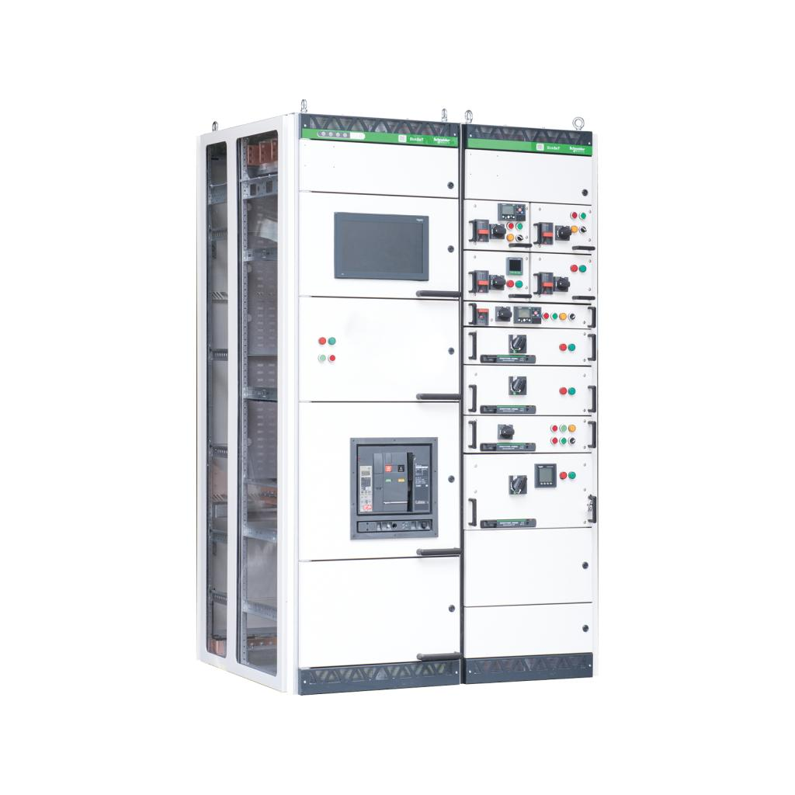
              

              

                
Eaton

                <h3 class="card__title"><a href="product-details.html?product=low-voltage-switchgear-unit">Low Voltage Switchgear Unit</a></h3>
                
<i class="fa-solid fa-star"></i><i class="fa-solid fa-star"></i><i class="fa-solid fa-star"></i><i class="fa-solid fa-star"></i><i class="fa-solid fa-star"></i>

                
₹1,32,000

                

                  Out of Stock
                

              

            

            

              

                Bestseller
                

                  <button aria-label="Add to wishlist"><i class="fa-regular fa-heart"></i></button>
                  <button aria-label="Quick view"><i class="fa-solid fa-eye"></i></button>
                

                
              

              

                
Samsung

                <h3 class="card__title"><a href="product-details.html?product=samsung-55-crystal-4k-smart-tv">55&Prime; Crystal 4K Smart TV</a></h3>
                
<i class="fa-solid fa-star"></i><i class="fa-solid fa-star"></i><i class="fa-solid fa-star"></i><i class="fa-solid fa-star"></i><i class="fa-solid fa-star-half-stroke"></i>

                
₹42,990

                

                  In Stock
                

              

            

            

              

                New
                

                  <button aria-label="Add to wishlist"><i class="fa-regular fa-heart"></i></button>
                  <button aria-label="Quick view"><i class="fa-solid fa-eye"></i></button>
                

                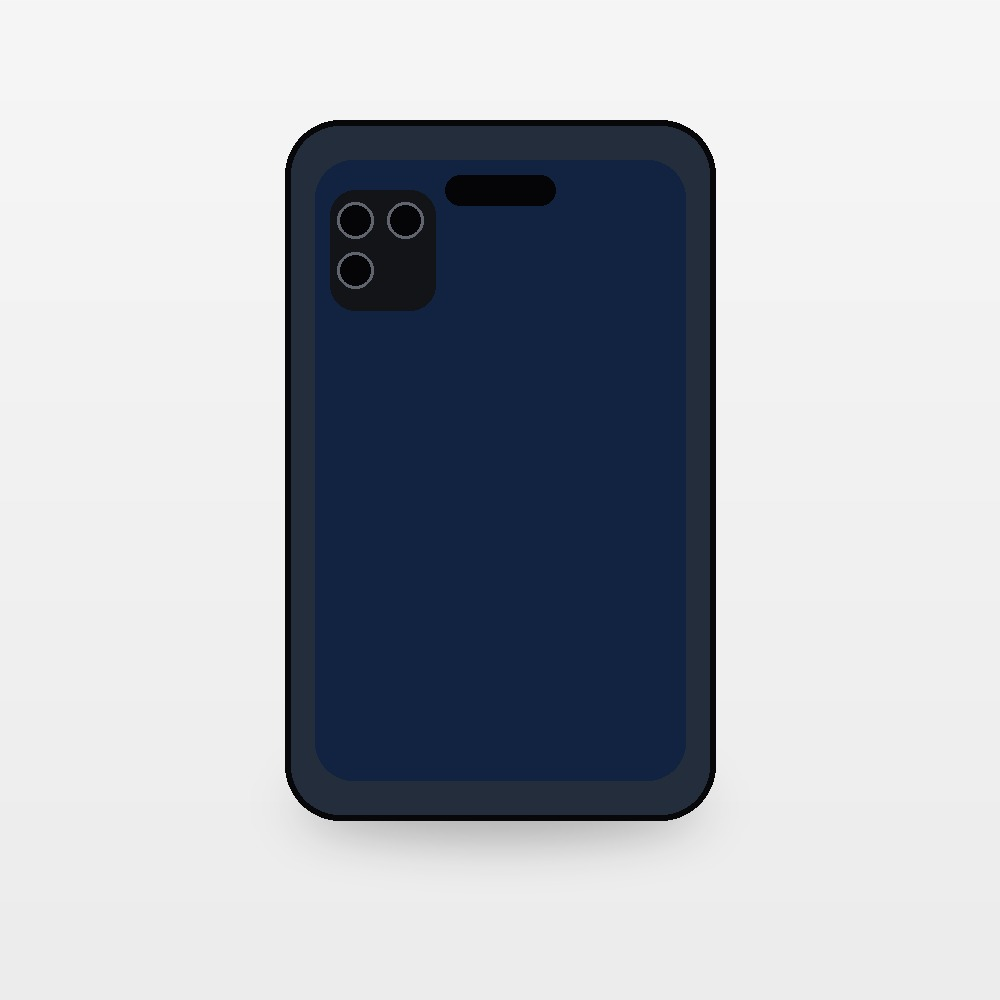
              

              

                
Apple

                <h3 class="card__title"><a href="product-details.html?product=apple-iphone-15-128gb">iPhone 15 (128GB)</a></h3>
                
<i class="fa-solid fa-star"></i><i class="fa-solid fa-star"></i><i class="fa-solid fa-star"></i><i class="fa-solid fa-star"></i><i class="fa-solid fa-star"></i>

                
₹65,900

                

                  In Stock
                

              

            

            

              

                

                  <button aria-label="Add to wishlist"><i class="fa-regular fa-heart"></i></button>
                  <button aria-label="Quick view"><i class="fa-solid fa-eye"></i></button>
                

                
              

              

                
LG

                <h3 class="card__title"><a href="product-details.html?product=lg-1-5-ton-inverter-split-ac">1.5 Ton 5-Star Inverter Split AC</a></h3>
                
<i class="fa-solid fa-star"></i><i class="fa-solid fa-star"></i><i class="fa-solid fa-star"></i><i class="fa-solid fa-star"></i><i class="fa-regular fa-star"></i>

                
₹38,490

                

                  In Stock
                

              

            

            

              

                

                  <button aria-label="Add to wishlist"><i class="fa-regular fa-heart"></i></button>
                  <button aria-label="Quick view"><i class="fa-solid fa-eye"></i></button>
                

                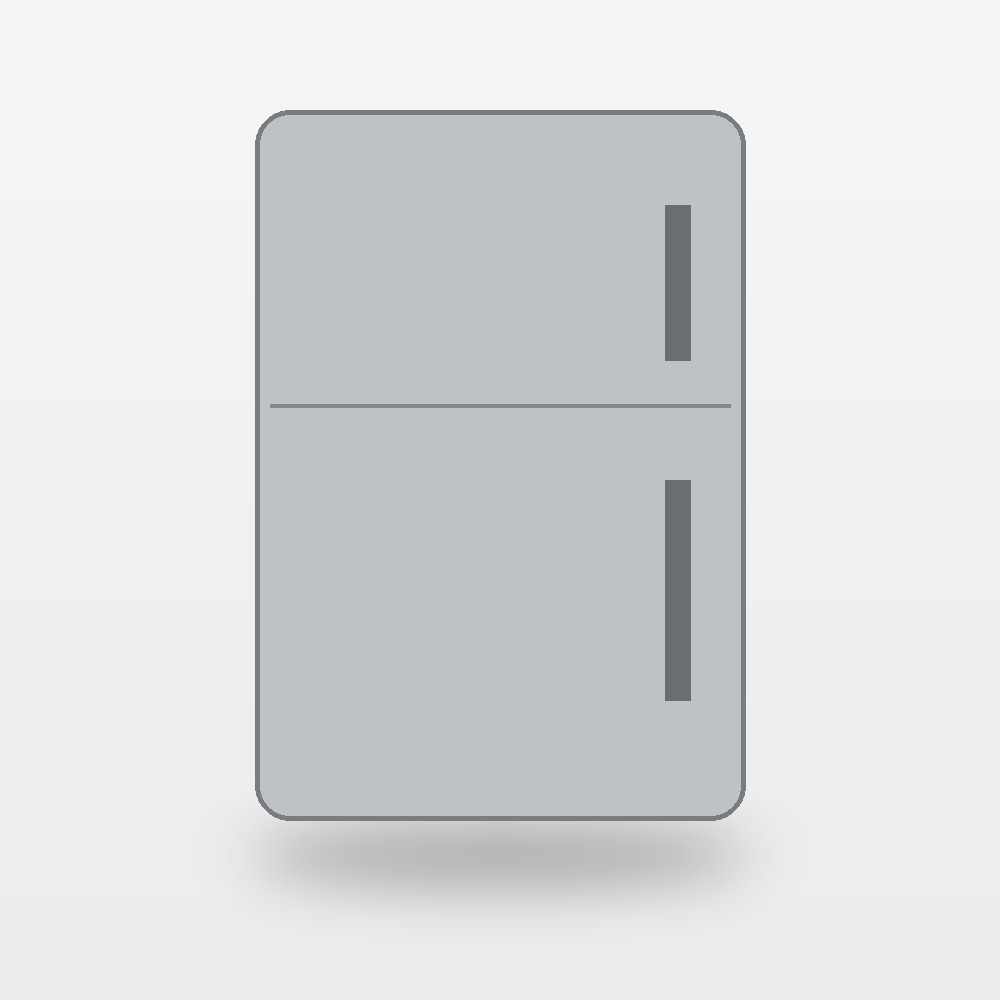
              

              

                
Samsung

                <h3 class="card__title"><a href="product-details.html?product=samsung-253l-double-door-refrigerator">253L 3-Star Double Door Refrigerator</a></h3>
                
<i class="fa-solid fa-star"></i><i class="fa-solid fa-star"></i><i class="fa-solid fa-star"></i><i class="fa-solid fa-star"></i><i class="fa-solid fa-star-half-stroke"></i>

                
₹27,990

                

                  Pre-Order
                

              

            

            

              

                

                  <button aria-label="Add to wishlist"><i class="fa-regular fa-heart"></i></button>
                  <button aria-label="Quick view"><i class="fa-solid fa-eye"></i></button>
                

                
              

              

                
Bosch

                <h3 class="card__title"><a href="product-details.html?product=bosch-front-load-washing-machine-7kg">Front Load Washing Machine 7kg</a></h3>
                
<i class="fa-solid fa-star"></i><i class="fa-solid fa-star"></i><i class="fa-solid fa-star"></i><i class="fa-solid fa-star"></i><i class="fa-regular fa-star"></i>

                
₹31,490

                

                  In Stock
                

              

            

            

              

                Bestseller
                

                  <button aria-label="Add to wishlist"><i class="fa-regular fa-heart"></i></button>
                  <button aria-label="Quick view"><i class="fa-solid fa-eye"></i></button>
                

                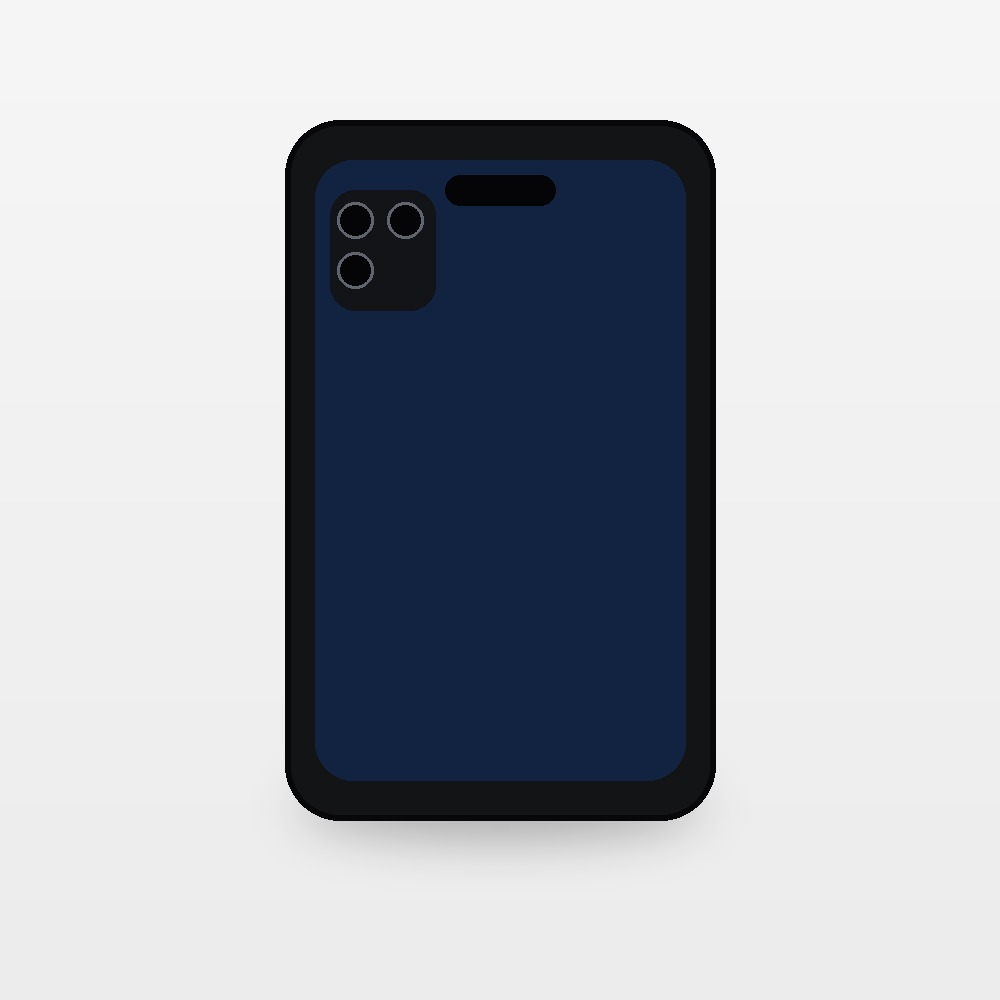
              

              

                
boAt

                <h3 class="card__title"><a href="product-details.html?product=boat-rockerz-450-headphones">Rockerz 450 Bluetooth Headphones</a></h3>
                
<i class="fa-solid fa-star"></i><i class="fa-solid fa-star"></i><i class="fa-solid fa-star"></i><i class="fa-solid fa-star"></i><i class="fa-regular fa-star"></i>

                
₹1,499

                

                  In Stock
                

              

            

            

              

                New
                

                  <button aria-label="Add to wishlist"><i class="fa-regular fa-heart"></i></button>
                  <button aria-label="Quick view"><i class="fa-solid fa-eye"></i></button>
                

                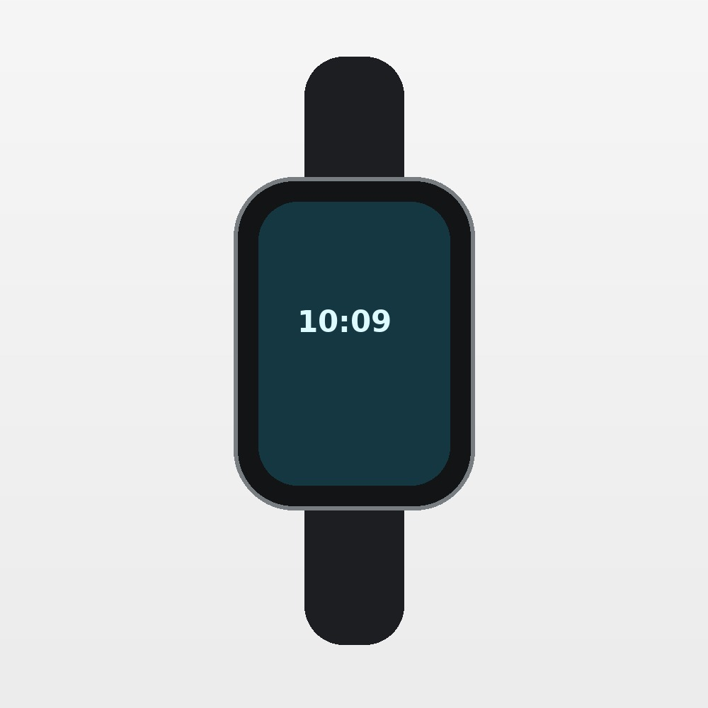
              

              

                
Noise

                <h3 class="card__title"><a href="product-details.html?product=noise-colorfit-pro-4-smartwatch">ColorFit Pro 4 Smartwatch</a></h3>
                
<i class="fa-solid fa-star"></i><i class="fa-solid fa-star"></i><i class="fa-solid fa-star"></i><i class="fa-solid fa-star"></i><i class="fa-regular fa-star"></i>

                
₹2,299

                

                  In Stock
                

              

            

            

              

                

                  <button aria-label="Add to wishlist"><i class="fa-regular fa-heart"></i></button>
                  <button aria-label="Quick view"><i class="fa-solid fa-eye"></i></button>
                

                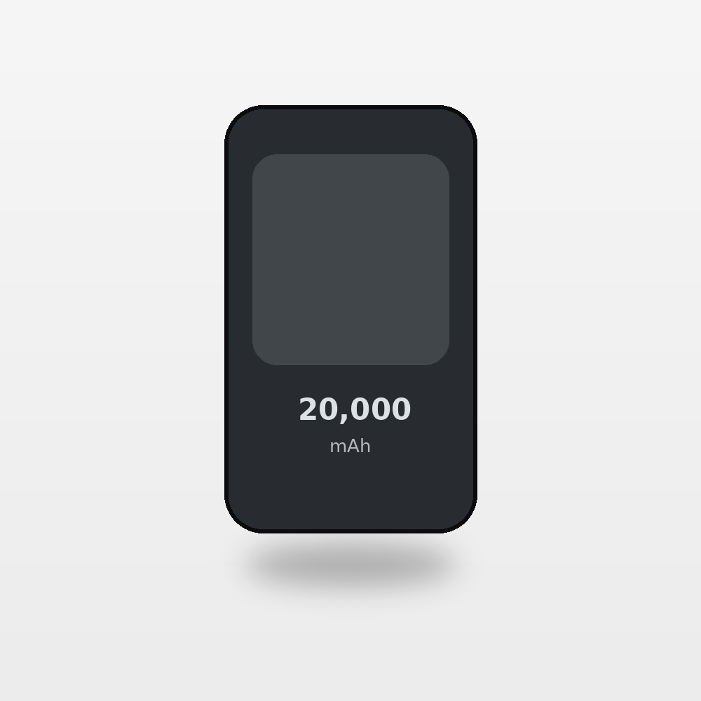
              

              

                
Mi

                <h3 class="card__title"><a href="product-details.html?product=mi-20000mah-power-bank">20000mAh Power Bank (22.5W)</a></h3>
                
<i class="fa-solid fa-star"></i><i class="fa-solid fa-star"></i><i class="fa-solid fa-star"></i><i class="fa-solid fa-star"></i><i class="fa-solid fa-star-half-stroke"></i>

                
₹1,899

                

                  In Stock
                

              

            

            

              

                Bestseller
                

                  <button aria-label="Add to wishlist"><i class="fa-regular fa-heart"></i></button>
                  <button aria-label="Quick view"><i class="fa-solid fa-eye"></i></button>
                

                
              

              

                
JBL

                <h3 class="card__title"><a href="product-details.html?product=jbl-flip-6-bluetooth-speaker">Flip 6 Portable Bluetooth Speaker</a></h3>
                
<i class="fa-solid fa-star"></i><i class="fa-solid fa-star"></i><i class="fa-solid fa-star"></i><i class="fa-solid fa-star"></i><i class="fa-solid fa-star"></i>

                
₹9,999

                

                  In Stock
                

              

            

            

              

                

                  <button aria-label="Add to wishlist"><i class="fa-regular fa-heart"></i></button>
                  <button aria-label="Quick view"><i class="fa-solid fa-eye"></i></button>
                

                
              

              

                
boAt

                <h3 class="card__title"><a href="product-details.html?product=boat-airdopes-141-earbuds">Airdopes 141 Wireless Earbuds</a></h3>
                
<i class="fa-solid fa-star"></i><i class="fa-solid fa-star"></i><i class="fa-solid fa-star"></i><i class="fa-solid fa-star"></i><i class="fa-regular fa-star"></i>

                
₹1,299

                

                  In Stock
                

              

            

            

              

                New
                

                  <button aria-label="Add to wishlist"><i class="fa-regular fa-heart"></i></button>
                  <button aria-label="Quick view"><i class="fa-solid fa-eye"></i></button>
                

                
              

              

                
GoPro

                <h3 class="card__title"><a href="product-details.html?product=gopro-hero12-action-camera">HERO12 Action Camera</a></h3>
                
<i class="fa-solid fa-star"></i><i class="fa-solid fa-star"></i><i class="fa-solid fa-star"></i><i class="fa-solid fa-star"></i><i class="fa-solid fa-star-half-stroke"></i>

                
₹35,990

                

                  Pre-Order
                

              

            

            

              

                Bestseller
                

                  <button aria-label="Add to wishlist"><i class="fa-regular fa-heart"></i></button>
                  <button aria-label="Quick view"><i class="fa-solid fa-eye"></i></button>
                

                
              

              

                
Samsung

                <h3 class="card__title"><a href="product-details.html?product=43-inch-4k-crystal-uhd-smart-tv">43-inch 4K Crystal UHD Smart TV</a></h3>
                
<i class="fa-solid fa-star"></i><i class="fa-solid fa-star"></i><i class="fa-solid fa-star"></i><i class="fa-solid fa-star"></i><i class="fa-solid fa-star-half-stroke"></i>

                
₹32,990

                
In Stock

              

            

            

              

                
                

                  <button aria-label="Add to wishlist"><i class="fa-regular fa-heart"></i></button>
                  <button aria-label="Quick view"><i class="fa-solid fa-eye"></i></button>
                

                
              

              

                
Sony

                <h3 class="card__title"><a href="product-details.html?product=50-inch-4k-uhd-google-tv">50-inch 4K UHD Google TV</a></h3>
                
<i class="fa-solid fa-star"></i><i class="fa-solid fa-star"></i><i class="fa-solid fa-star"></i><i class="fa-solid fa-star"></i><i class="fa-solid fa-star-half-stroke"></i>

                
₹44,990

                
In Stock

              

            

            

              

                Bestseller
                

                  <button aria-label="Add to wishlist"><i class="fa-regular fa-heart"></i></button>
                  <button aria-label="Quick view"><i class="fa-solid fa-eye"></i></button>
                

                
              

              

                
Samsung

                <h3 class="card__title"><a href="product-details.html?product=55-inch-qled-4k-smart-tv">55-inch QLED 4K Smart TV</a></h3>
                
<i class="fa-solid fa-star"></i><i class="fa-solid fa-star"></i><i class="fa-solid fa-star"></i><i class="fa-solid fa-star"></i><i class="fa-solid fa-star-half-stroke"></i>

                
₹58,990

                
In Stock

              

            

            

              

                New
                

                  <button aria-label="Add to wishlist"><i class="fa-regular fa-heart"></i></button>
                  <button aria-label="Quick view"><i class="fa-solid fa-eye"></i></button>
                

                
              

              

                
LG

                <h3 class="card__title"><a href="product-details.html?product=65-inch-oled-4k-smart-tv">65-inch OLED 4K Smart TV</a></h3>
                
<i class="fa-solid fa-star"></i><i class="fa-solid fa-star"></i><i class="fa-solid fa-star"></i><i class="fa-solid fa-star"></i><i class="fa-solid fa-star-half-stroke"></i>

                
₹1,24,990

                
Pre-Order

              

            

            

              

                
                

                  <button aria-label="Add to wishlist"><i class="fa-regular fa-heart"></i></button>
                  <button aria-label="Quick view"><i class="fa-solid fa-eye"></i></button>
                

                
              

              

                
TCL

                <h3 class="card__title"><a href="product-details.html?product=43-inch-4k-android-smart-tv">43-inch 4K Android Smart TV</a></h3>
                
<i class="fa-solid fa-star"></i><i class="fa-solid fa-star"></i><i class="fa-solid fa-star"></i><i class="fa-solid fa-star"></i><i class="fa-regular fa-star"></i>

                
₹27,499

                
In Stock

              

            

            

              

                New
                

                  <button aria-label="Add to wishlist"><i class="fa-regular fa-heart"></i></button>
                  <button aria-label="Quick view"><i class="fa-solid fa-eye"></i></button>
                

                
              

              

                
TCL

                <h3 class="card__title"><a href="product-details.html?product=55-inch-mini-led-4k-google-tv">55-inch Mini LED 4K Google TV</a></h3>
                
<i class="fa-solid fa-star"></i><i class="fa-solid fa-star"></i><i class="fa-solid fa-star"></i><i class="fa-solid fa-star"></i><i class="fa-solid fa-star-half-stroke"></i>

                
₹69,990

                
In Stock

              

            

            

              

                
                

                  <button aria-label="Add to wishlist"><i class="fa-regular fa-heart"></i></button>
                  <button aria-label="Quick view"><i class="fa-solid fa-eye"></i></button>
                

                
              

              

                
OnePlus

                <h3 class="card__title"><a href="product-details.html?product=32-inch-hd-ready-smart-led-tv">32-inch HD Ready Smart LED TV</a></h3>
                
<i class="fa-solid fa-star"></i><i class="fa-solid fa-star"></i><i class="fa-solid fa-star"></i><i class="fa-solid fa-star"></i><i class="fa-regular fa-star"></i>

                
₹15,999

                
In Stock

              

            

            

              

                
                

                  <button aria-label="Add to wishlist"><i class="fa-regular fa-heart"></i></button>
                  <button aria-label="Quick view"><i class="fa-solid fa-eye"></i></button>
                

                
              

              

                
Hisense

                <h3 class="card__title"><a href="product-details.html?product=55-inch-4k-ultra-hd-smart-tv">55-inch 4K Ultra HD Smart TV</a></h3>
                
<i class="fa-solid fa-star"></i><i class="fa-solid fa-star"></i><i class="fa-solid fa-star"></i><i class="fa-solid fa-star"></i><i class="fa-solid fa-star-half-stroke"></i>

                
₹39,990

                
In Stock

              

            

            

              

                
                

                  <button aria-label="Add to wishlist"><i class="fa-regular fa-heart"></i></button>
                  <button aria-label="Quick view"><i class="fa-solid fa-eye"></i></button>
                

                
              

              

                
Acer

                <h3 class="card__title"><a href="product-details.html?product=65-inch-qled-4k-smart-tv">65-inch QLED 4K Smart TV</a></h3>
                
<i class="fa-solid fa-star"></i><i class="fa-solid fa-star"></i><i class="fa-solid fa-star"></i><i class="fa-solid fa-star"></i><i class="fa-regular fa-star"></i>

                
₹74,990

                
Pre-Order

              

            

            

              

                Premium
                

                  <button aria-label="Add to wishlist"><i class="fa-regular fa-heart"></i></button>
                  <button aria-label="Quick view"><i class="fa-solid fa-eye"></i></button>
                

                
              

              

                
Sony

                <h3 class="card__title"><a href="product-details.html?product=75-inch-4k-google-tv">75-inch 4K Google TV</a></h3>
                
<i class="fa-solid fa-star"></i><i class="fa-solid fa-star"></i><i class="fa-solid fa-star"></i><i class="fa-solid fa-star"></i><i class="fa-solid fa-star-half-stroke"></i>

                
₹1,49,990

                
Pre-Order

              

            

            

              

                New
                

                  <button aria-label="Add to wishlist"><i class="fa-regular fa-heart"></i></button>
                  <button aria-label="Quick view"><i class="fa-solid fa-eye"></i></button>
                

                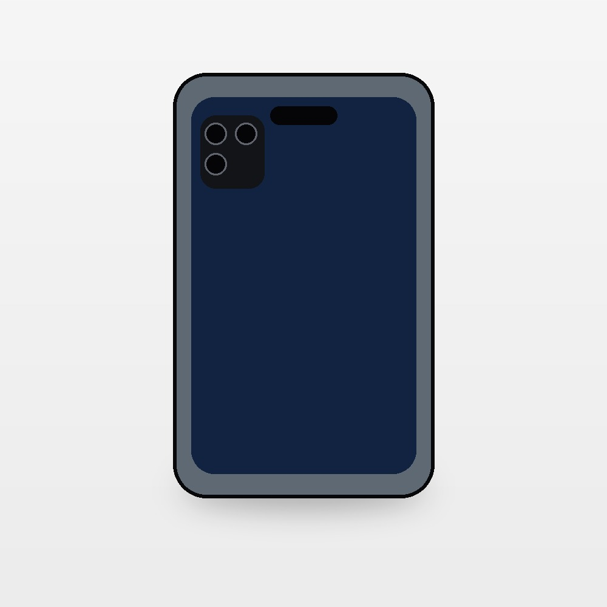
              

              

                
Samsung

                <h3 class="card__title"><a href="product-details.html?product=galaxy-s26-ultra-5g-256gb">Galaxy S26 Ultra 5G 256GB</a></h3>
                
<i class="fa-solid fa-star"></i><i class="fa-solid fa-star"></i><i class="fa-solid fa-star"></i><i class="fa-solid fa-star"></i><i class="fa-solid fa-star-half-stroke"></i>

                
₹1,39,999

                
Pre-Order

              

            

            

              

                
                

                  <button aria-label="Add to wishlist"><i class="fa-regular fa-heart"></i></button>
                  <button aria-label="Quick view"><i class="fa-solid fa-eye"></i></button>
                

                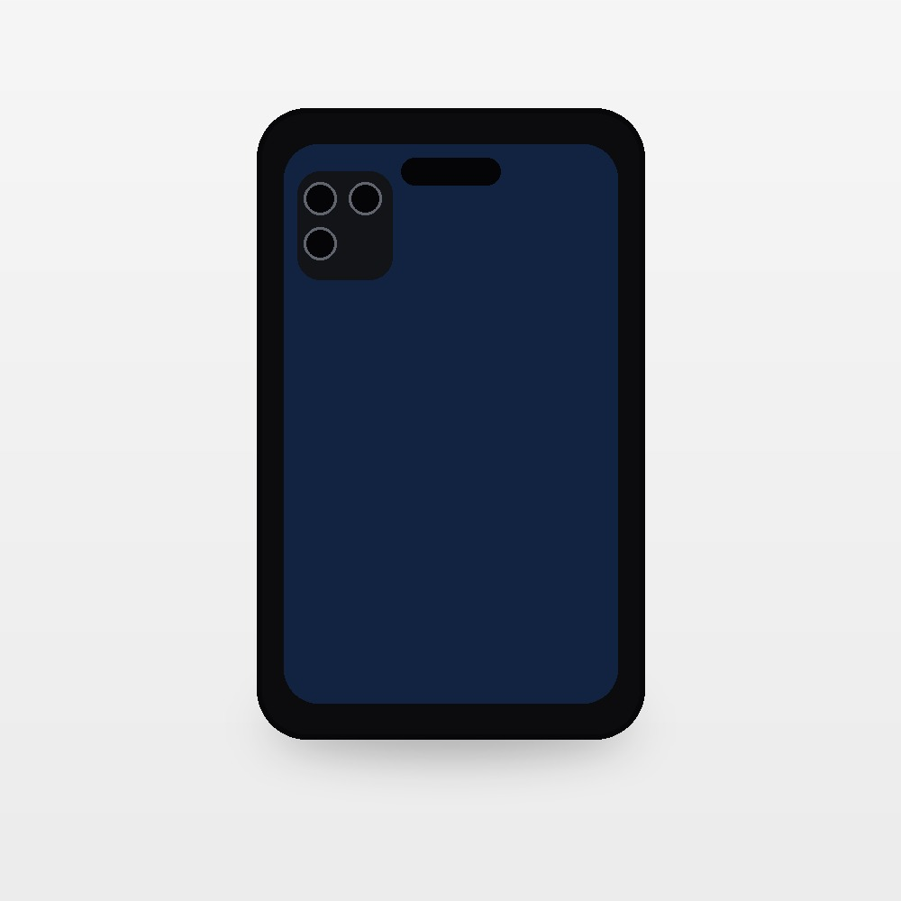
              

              

                
Samsung

                <h3 class="card__title"><a href="product-details.html?product=galaxy-s26-5g-256gb">Galaxy S26+ 5G 256GB</a></h3>
                
<i class="fa-solid fa-star"></i><i class="fa-solid fa-star"></i><i class="fa-solid fa-star"></i><i class="fa-solid fa-star"></i><i class="fa-solid fa-star-half-stroke"></i>

                
₹1,09,999

                
In Stock

              

            

            

              

                Bestseller
                

                  <button aria-label="Add to wishlist"><i class="fa-regular fa-heart"></i></button>
                  <button aria-label="Quick view"><i class="fa-solid fa-eye"></i></button>
                

                
              

              

                
Samsung

                <h3 class="card__title"><a href="product-details.html?product=galaxy-a57-5g-256gb">Galaxy A57 5G 256GB</a></h3>
                
<i class="fa-solid fa-star"></i><i class="fa-solid fa-star"></i><i class="fa-solid fa-star"></i><i class="fa-solid fa-star"></i><i class="fa-solid fa-star-half-stroke"></i>

                
₹41,999

                
In Stock

              

            

            

              

                Bestseller
                

                  <button aria-label="Add to wishlist"><i class="fa-regular fa-heart"></i></button>
                  <button aria-label="Quick view"><i class="fa-solid fa-eye"></i></button>
                

                
              

              

                
Apple

                <h3 class="card__title"><a href="product-details.html?product=iphone-17-pro-256gb">iPhone 17 Pro 256GB</a></h3>
                
<i class="fa-solid fa-star"></i><i class="fa-solid fa-star"></i><i class="fa-solid fa-star"></i><i class="fa-solid fa-star"></i><i class="fa-solid fa-star-half-stroke"></i>

                
₹1,34,900

                
In Stock

              

            

            

              

                
                

                  <button aria-label="Add to wishlist"><i class="fa-regular fa-heart"></i></button>
                  <button aria-label="Quick view"><i class="fa-solid fa-eye"></i></button>
                

                
              

              

                
Apple

                <h3 class="card__title"><a href="product-details.html?product=iphone-17-256gb">iPhone 17 256GB</a></h3>
                
<i class="fa-solid fa-star"></i><i class="fa-solid fa-star"></i><i class="fa-solid fa-star"></i><i class="fa-solid fa-star"></i><i class="fa-solid fa-star-half-stroke"></i>

                
₹89,900

                
In Stock

              

            

            

              

                New
                

                  <button aria-label="Add to wishlist"><i class="fa-regular fa-heart"></i></button>
                  <button aria-label="Quick view"><i class="fa-solid fa-eye"></i></button>
                

                
              

              

                
Apple

                <h3 class="card__title"><a href="product-details.html?product=iphone-air-256gb">iPhone Air 256GB</a></h3>
                
<i class="fa-solid fa-star"></i><i class="fa-solid fa-star"></i><i class="fa-solid fa-star"></i><i class="fa-solid fa-star"></i><i class="fa-solid fa-star-half-stroke"></i>

                
₹99,900

                
Pre-Order

              

            

            

              

                
                

                  <button aria-label="Add to wishlist"><i class="fa-regular fa-heart"></i></button>
                  <button aria-label="Quick view"><i class="fa-solid fa-eye"></i></button>
                

                
              

              

                
OnePlus

                <h3 class="card__title"><a href="product-details.html?product=oneplus-13-5g-256gb">OnePlus 13 5G 256GB</a></h3>
                
<i class="fa-solid fa-star"></i><i class="fa-solid fa-star"></i><i class="fa-solid fa-star"></i><i class="fa-solid fa-star"></i><i class="fa-solid fa-star-half-stroke"></i>

                
₹69,999

                
In Stock

              

            

            

              

                
                

                  <button aria-label="Add to wishlist"><i class="fa-regular fa-heart"></i></button>
                  <button aria-label="Quick view"><i class="fa-solid fa-eye"></i></button>
                

                
              

              

                
Xiaomi

                <h3 class="card__title"><a href="product-details.html?product=xiaomi-15-ultra-5g">Xiaomi 15 Ultra 5G</a></h3>
                
<i class="fa-solid fa-star"></i><i class="fa-solid fa-star"></i><i class="fa-solid fa-star"></i><i class="fa-solid fa-star"></i><i class="fa-solid fa-star-half-stroke"></i>

                
₹89,999

                
In Stock

              

            

            

              

                
                

                  <button aria-label="Add to wishlist"><i class="fa-regular fa-heart"></i></button>
                  <button aria-label="Quick view"><i class="fa-solid fa-eye"></i></button>
                

                
              

              

                
Vivo

                <h3 class="card__title"><a href="product-details.html?product=vivo-x200-pro-5g">Vivo X200 Pro 5G</a></h3>
                
<i class="fa-solid fa-star"></i><i class="fa-solid fa-star"></i><i class="fa-solid fa-star"></i><i class="fa-solid fa-star"></i><i class="fa-solid fa-star-half-stroke"></i>

                
₹94,999

                
In Stock

              

            

            

              

                
                

                  <button aria-label="Add to wishlist"><i class="fa-regular fa-heart"></i></button>
                  <button aria-label="Quick view"><i class="fa-solid fa-eye"></i></button>
                

                
              

              

                
OPPO

                <h3 class="card__title"><a href="product-details.html?product=oppo-find-x8-pro-5g">OPPO Find X8 Pro 5G</a></h3>
                
<i class="fa-solid fa-star"></i><i class="fa-solid fa-star"></i><i class="fa-solid fa-star"></i><i class="fa-solid fa-star"></i><i class="fa-solid fa-star-half-stroke"></i>

                
₹99,999

                
In Stock

              

            

            

              

                
                

                  <button aria-label="Add to wishlist"><i class="fa-regular fa-heart"></i></button>
                  <button aria-label="Quick view"><i class="fa-solid fa-eye"></i></button>
                

                
              

              

                
Motorola

                <h3 class="card__title"><a href="product-details.html?product=motorola-edge-60-pro-5g">Motorola Edge 60 Pro 5G</a></h3>
                
<i class="fa-solid fa-star"></i><i class="fa-solid fa-star"></i><i class="fa-solid fa-star"></i><i class="fa-solid fa-star"></i><i class="fa-solid fa-star-half-stroke"></i>

                
₹39,999

                
In Stock

              

            

            

              

                New
                

                  <button aria-label="Add to wishlist"><i class="fa-regular fa-heart"></i></button>
                  <button aria-label="Quick view"><i class="fa-solid fa-eye"></i></button>
                

                
              

              

                
Samsung

                <h3 class="card__title"><a href="product-details.html?product=galaxy-z-fold8">Galaxy Z Fold8</a></h3>
                
<i class="fa-solid fa-star"></i><i class="fa-solid fa-star"></i><i class="fa-solid fa-star"></i><i class="fa-solid fa-star"></i><i class="fa-solid fa-star-half-stroke"></i>

                
₹1,74,999

                
Pre-Order

              

            

            

              

                Bestseller
                

                  <button aria-label="Add to wishlist"><i class="fa-regular fa-heart"></i></button>
                  <button aria-label="Quick view"><i class="fa-solid fa-eye"></i></button>
                

                
              

              

                
LG

                <h3 class="card__title"><a href="product-details.html?product=1-ton-5-star-dual-inverter-split-ac">1 Ton 5-Star Dual Inverter Split AC</a></h3>
                
<i class="fa-solid fa-star"></i><i class="fa-solid fa-star"></i><i class="fa-solid fa-star"></i><i class="fa-solid fa-star"></i><i class="fa-solid fa-star-half-stroke"></i>

                
₹39,990

                
In Stock

              

            

            

              

                
                

                  <button aria-label="Add to wishlist"><i class="fa-regular fa-heart"></i></button>
                  <button aria-label="Quick view"><i class="fa-solid fa-eye"></i></button>
                

                
              

              

                
LG

                <h3 class="card__title"><a href="product-details.html?product=1-5-ton-5-star-dual-inverter-split-ac">1.5 Ton 5-Star Dual Inverter Split AC</a></h3>
                
<i class="fa-solid fa-star"></i><i class="fa-solid fa-star"></i><i class="fa-solid fa-star"></i><i class="fa-solid fa-star"></i><i class="fa-solid fa-star-half-stroke"></i>

                
₹46,990

                
In Stock

              

            

            

              

                Bestseller
                

                  <button aria-label="Add to wishlist"><i class="fa-regular fa-heart"></i></button>
                  <button aria-label="Quick view"><i class="fa-solid fa-eye"></i></button>
                

                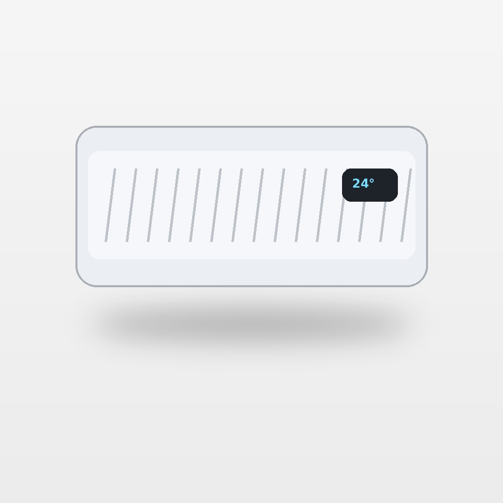
              

              

                
Daikin

                <h3 class="card__title"><a href="product-details.html?product=1-5-ton-5-star-inverter-split-ac">1.5 Ton 5-Star Inverter Split AC</a></h3>
                
<i class="fa-solid fa-star"></i><i class="fa-solid fa-star"></i><i class="fa-solid fa-star"></i><i class="fa-solid fa-star"></i><i class="fa-solid fa-star-half-stroke"></i>

                
₹52,990

                
In Stock

              

            

            

              

                
                

                  <button aria-label="Add to wishlist"><i class="fa-regular fa-heart"></i></button>
                  <button aria-label="Quick view"><i class="fa-solid fa-eye"></i></button>
                

                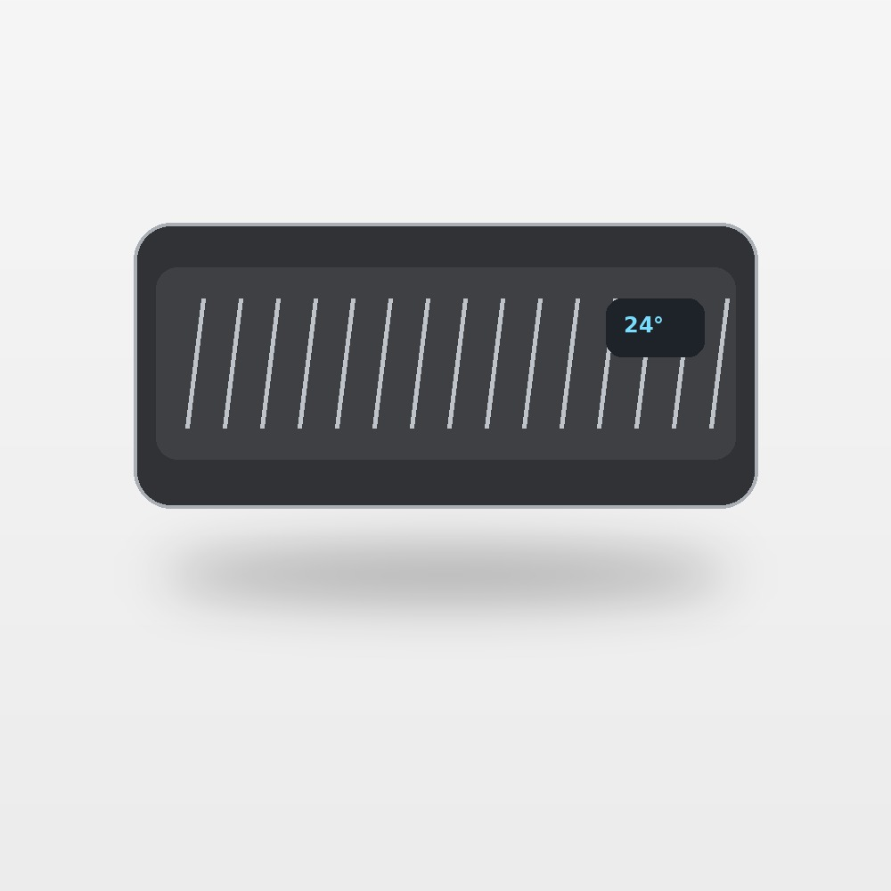
              

              

                
Daikin

                <h3 class="card__title"><a href="product-details.html?product=2-ton-5-star-inverter-split-ac">2 Ton 5-Star Inverter Split AC</a></h3>
                
<i class="fa-solid fa-star"></i><i class="fa-solid fa-star"></i><i class="fa-solid fa-star"></i><i class="fa-solid fa-star"></i><i class="fa-solid fa-star-half-stroke"></i>

                
₹67,990

                
In Stock

              

            

            

              

                
                

                  <button aria-label="Add to wishlist"><i class="fa-regular fa-heart"></i></button>
                  <button aria-label="Quick view"><i class="fa-solid fa-eye"></i></button>
                

                
              

              

                
Samsung

                <h3 class="card__title"><a href="product-details.html?product=1-5-ton-5-star-inverter-split-ac">1.5 Ton 5-Star Inverter Split AC</a></h3>
                
<i class="fa-solid fa-star"></i><i class="fa-solid fa-star"></i><i class="fa-solid fa-star"></i><i class="fa-solid fa-star"></i><i class="fa-solid fa-star-half-stroke"></i>

                
₹49,490

                
In Stock

              

            

            

              

                
                

                  <button aria-label="Add to wishlist"><i class="fa-regular fa-heart"></i></button>
                  <button aria-label="Quick view"><i class="fa-solid fa-eye"></i></button>
                

                
              

              

                
Voltas

                <h3 class="card__title"><a href="product-details.html?product=1-5-ton-3-star-window-ac">1.5 Ton 3-Star Window AC</a></h3>
                
<i class="fa-solid fa-star"></i><i class="fa-solid fa-star"></i><i class="fa-solid fa-star"></i><i class="fa-solid fa-star"></i><i class="fa-regular fa-star"></i>

                
₹31,990

                
In Stock

              

            

            

              

                
                

                  <button aria-label="Add to wishlist"><i class="fa-regular fa-heart"></i></button>
                  <button aria-label="Quick view"><i class="fa-solid fa-eye"></i></button>
                

                
              

              

                
Blue Star

                <h3 class="card__title"><a href="product-details.html?product=1-5-ton-5-star-split-ac">1.5 Ton 5-Star Split AC</a></h3>
                
<i class="fa-solid fa-star"></i><i class="fa-solid fa-star"></i><i class="fa-solid fa-star"></i><i class="fa-solid fa-star"></i><i class="fa-solid fa-star-half-stroke"></i>

                
₹44,990

                
In Stock

              

            

            

              

                New
                

                  <button aria-label="Add to wishlist"><i class="fa-regular fa-heart"></i></button>
                  <button aria-label="Quick view"><i class="fa-solid fa-eye"></i></button>
                

                
              

              

                
Panasonic

                <h3 class="card__title"><a href="product-details.html?product=1-5-ton-5-star-inverter-ac">1.5 Ton 5-Star Inverter AC</a></h3>
                
<i class="fa-solid fa-star"></i><i class="fa-solid fa-star"></i><i class="fa-solid fa-star"></i><i class="fa-solid fa-star"></i><i class="fa-solid fa-star-half-stroke"></i>

                
₹43,990

                
Pre-Order

              

            

            

              

                
                

                  <button aria-label="Add to wishlist"><i class="fa-regular fa-heart"></i></button>
                  <button aria-label="Quick view"><i class="fa-solid fa-eye"></i></button>
                

                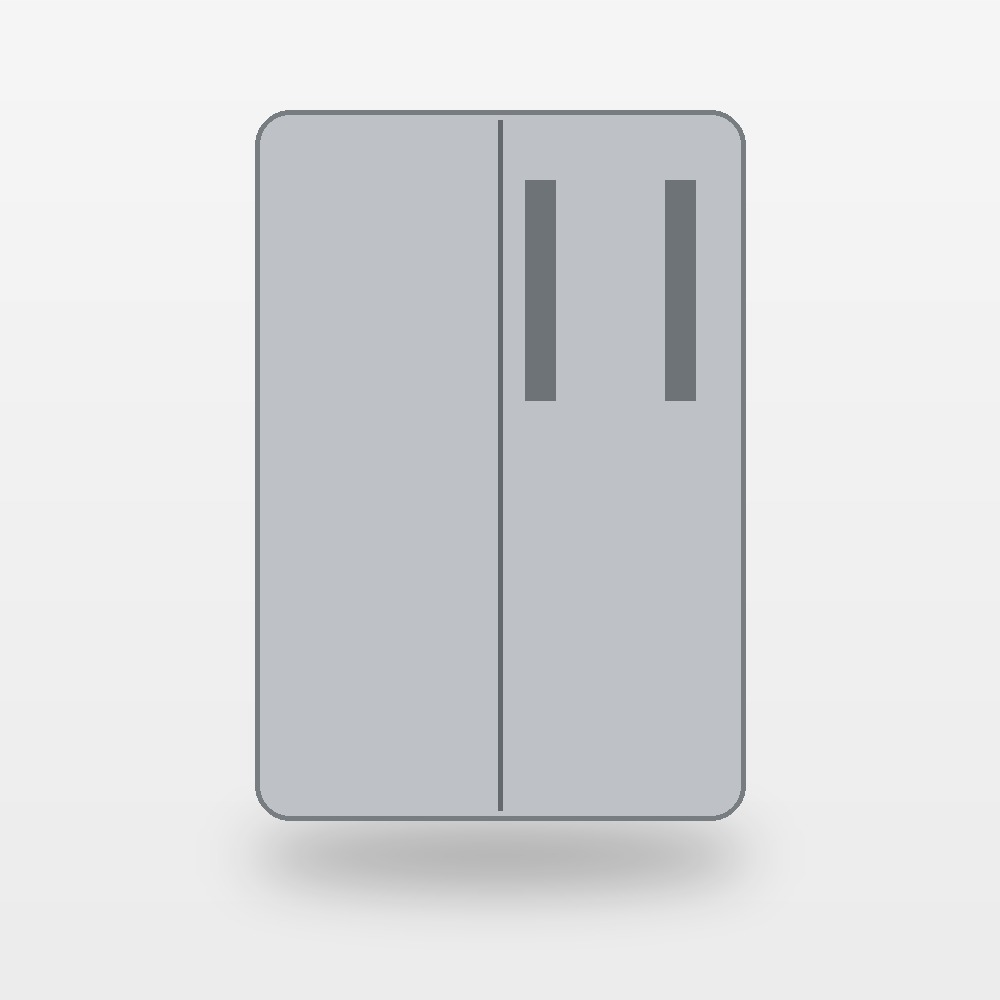
              

              

                
LG

                <h3 class="card__title"><a href="product-details.html?product=185l-5-star-single-door-refrigerator">185L 5-Star Single Door Refrigerator</a></h3>
                
<i class="fa-solid fa-star"></i><i class="fa-solid fa-star"></i><i class="fa-solid fa-star"></i><i class="fa-solid fa-star"></i><i class="fa-solid fa-star-half-stroke"></i>

                
₹18,490

                
In Stock

              

            

            

              

                Bestseller
                

                  <button aria-label="Add to wishlist"><i class="fa-regular fa-heart"></i></button>
                  <button aria-label="Quick view"><i class="fa-solid fa-eye"></i></button>
                

                
              

              

                
Samsung

                <h3 class="card__title"><a href="product-details.html?product=236l-3-star-double-door-refrigerator">236L 3-Star Double Door Refrigerator</a></h3>
                
<i class="fa-solid fa-star"></i><i class="fa-solid fa-star"></i><i class="fa-solid fa-star"></i><i class="fa-solid fa-star"></i><i class="fa-solid fa-star-half-stroke"></i>

                
₹27,990

                
In Stock

              

            

            

              

                
                

                  <button aria-label="Add to wishlist"><i class="fa-regular fa-heart"></i></button>
                  <button aria-label="Quick view"><i class="fa-solid fa-eye"></i></button>
                

                
              

              

                
Whirlpool

                <h3 class="card__title"><a href="product-details.html?product=253l-convertible-double-door-refrigerator">253L Convertible Double Door Refrigerator</a></h3>
                
<i class="fa-solid fa-star"></i><i class="fa-solid fa-star"></i><i class="fa-solid fa-star"></i><i class="fa-solid fa-star"></i><i class="fa-solid fa-star-half-stroke"></i>

                
₹31,490

                
In Stock

              

            

            

              

                
                

                  <button aria-label="Add to wishlist"><i class="fa-regular fa-heart"></i></button>
                  <button aria-label="Quick view"><i class="fa-solid fa-eye"></i></button>
                

                
              

              

                
LG

                <h3 class="card__title"><a href="product-details.html?product=340l-frost-free-double-door-refrigerator">340L Frost Free Double Door Refrigerator</a></h3>
                
<i class="fa-solid fa-star"></i><i class="fa-solid fa-star"></i><i class="fa-solid fa-star"></i><i class="fa-solid fa-star"></i><i class="fa-solid fa-star-half-stroke"></i>

                
₹42,990

                
In Stock

              

            

            

              

                Premium
                

                  <button aria-label="Add to wishlist"><i class="fa-regular fa-heart"></i></button>
                  <button aria-label="Quick view"><i class="fa-solid fa-eye"></i></button>
                

                
              

              

                
Haier

                <h3 class="card__title"><a href="product-details.html?product=415l-side-by-side-refrigerator">415L Side-by-Side Refrigerator</a></h3>
                
<i class="fa-solid fa-star"></i><i class="fa-solid fa-star"></i><i class="fa-solid fa-star"></i><i class="fa-solid fa-star"></i><i class="fa-solid fa-star-half-stroke"></i>

                
₹62,990

                
In Stock

              

            

            

              

                Premium
                

                  <button aria-label="Add to wishlist"><i class="fa-regular fa-heart"></i></button>
                  <button aria-label="Quick view"><i class="fa-solid fa-eye"></i></button>
                

                
              

              

                
Samsung

                <h3 class="card__title"><a href="product-details.html?product=650l-french-door-refrigerator">650L French Door Refrigerator</a></h3>
                
<i class="fa-solid fa-star"></i><i class="fa-solid fa-star"></i><i class="fa-solid fa-star"></i><i class="fa-solid fa-star"></i><i class="fa-solid fa-star-half-stroke"></i>

                
₹1,29,990

                
Pre-Order

              

            

            

              

                
                

                  <button aria-label="Add to wishlist"><i class="fa-regular fa-heart"></i></button>
                  <button aria-label="Quick view"><i class="fa-solid fa-eye"></i></button>
                

                
              

              

                
Godrej

                <h3 class="card__title"><a href="product-details.html?product=240l-convertible-refrigerator">240L Convertible Refrigerator</a></h3>
                
<i class="fa-solid fa-star"></i><i class="fa-solid fa-star"></i><i class="fa-solid fa-star"></i><i class="fa-solid fa-star"></i><i class="fa-regular fa-star"></i>

                
₹25,490

                
In Stock

              

            

            

              

                
                

                  <button aria-label="Add to wishlist"><i class="fa-regular fa-heart"></i></button>
                  <button aria-label="Quick view"><i class="fa-solid fa-eye"></i></button>
                

                
              

              

                
Panasonic

                <h3 class="card__title"><a href="product-details.html?product=190l-direct-cool-refrigerator">190L Direct Cool Refrigerator</a></h3>
                
<i class="fa-solid fa-star"></i><i class="fa-solid fa-star"></i><i class="fa-solid fa-star"></i><i class="fa-solid fa-star"></i><i class="fa-regular fa-star"></i>

                
₹17,990

                
In Stock

              

            

            

              

                Bestseller
                

                  <button aria-label="Add to wishlist"><i class="fa-regular fa-heart"></i></button>
                  <button aria-label="Quick view"><i class="fa-solid fa-eye"></i></button>
                

                
              

              

                
LG

                <h3 class="card__title"><a href="product-details.html?product=7kg-5-star-fully-automatic-front-load">7kg 5-Star Fully Automatic Front Load</a></h3>
                
<i class="fa-solid fa-star"></i><i class="fa-solid fa-star"></i><i class="fa-solid fa-star"></i><i class="fa-solid fa-star"></i><i class="fa-solid fa-star-half-stroke"></i>

                
₹34,990

                
In Stock

              

            

            

              

                New
                

                  <button aria-label="Add to wishlist"><i class="fa-regular fa-heart"></i></button>
                  <button aria-label="Quick view"><i class="fa-solid fa-eye"></i></button>
                

                
              

              

                
Samsung

                <h3 class="card__title"><a href="product-details.html?product=8kg-ai-ecobubble-front-load">8kg AI Ecobubble Front Load</a></h3>
                
<i class="fa-solid fa-star"></i><i class="fa-solid fa-star"></i><i class="fa-solid fa-star"></i><i class="fa-solid fa-star"></i><i class="fa-solid fa-star-half-stroke"></i>

                
₹42,990

                
In Stock

              

            

            

              

                
                

                  <button aria-label="Add to wishlist"><i class="fa-regular fa-heart"></i></button>
                  <button aria-label="Quick view"><i class="fa-solid fa-eye"></i></button>
                

                
              

              

                
IFB

                <h3 class="card__title"><a href="product-details.html?product=9kg-fully-automatic-front-load">9kg Fully Automatic Front Load</a></h3>
                
<i class="fa-solid fa-star"></i><i class="fa-solid fa-star"></i><i class="fa-solid fa-star"></i><i class="fa-solid fa-star"></i><i class="fa-solid fa-star-half-stroke"></i>

                
₹39,990

                
In Stock

              

            

            

              

                
                

                  <button aria-label="Add to wishlist"><i class="fa-regular fa-heart"></i></button>
                  <button aria-label="Quick view"><i class="fa-solid fa-eye"></i></button>
                

                
              

              

                
Bosch

                <h3 class="card__title"><a href="product-details.html?product=8kg-fully-automatic-front-load">8kg Fully Automatic Front Load</a></h3>
                
<i class="fa-solid fa-star"></i><i class="fa-solid fa-star"></i><i class="fa-solid fa-star"></i><i class="fa-solid fa-star"></i><i class="fa-solid fa-star-half-stroke"></i>

                
₹44,490

                
In Stock

              

            

            

              

                
                

                  <button aria-label="Add to wishlist"><i class="fa-regular fa-heart"></i></button>
                  <button aria-label="Quick view"><i class="fa-solid fa-eye"></i></button>
                

                
              

              

                
Whirlpool

                <h3 class="card__title"><a href="product-details.html?product=7kg-5-star-top-load-washing-machine">7kg 5-Star Top Load Washing Machine</a></h3>
                
<i class="fa-solid fa-star"></i><i class="fa-solid fa-star"></i><i class="fa-solid fa-star"></i><i class="fa-solid fa-star"></i><i class="fa-solid fa-star-half-stroke"></i>

                
₹24,990

                
In Stock

              

            

            

              

                
                

                  <button aria-label="Add to wishlist"><i class="fa-regular fa-heart"></i></button>
                  <button aria-label="Quick view"><i class="fa-solid fa-eye"></i></button>
                

                
              

              

                
Godrej

                <h3 class="card__title"><a href="product-details.html?product=8kg-fully-automatic-top-load">8kg Fully Automatic Top Load</a></h3>
                
<i class="fa-solid fa-star"></i><i class="fa-solid fa-star"></i><i class="fa-solid fa-star"></i><i class="fa-solid fa-star"></i><i class="fa-regular fa-star"></i>

                
₹22,990

                
In Stock

              

            

            

              

                
                

                  <button aria-label="Add to wishlist"><i class="fa-regular fa-heart"></i></button>
                  <button aria-label="Quick view"><i class="fa-solid fa-eye"></i></button>
                

                
              

              

                
Panasonic

                <h3 class="card__title"><a href="product-details.html?product=7kg-semi-automatic-washing-machine">7kg Semi Automatic Washing Machine</a></h3>
                
<i class="fa-solid fa-star"></i><i class="fa-solid fa-star"></i><i class="fa-solid fa-star"></i><i class="fa-solid fa-star"></i><i class="fa-regular fa-star"></i>

                
₹14,990

                
In Stock

              

            

            

              

                Premium
                

                  <button aria-label="Add to wishlist"><i class="fa-regular fa-heart"></i></button>
                  <button aria-label="Quick view"><i class="fa-solid fa-eye"></i></button>
                

                
              

              

                
Samsung

                <h3 class="card__title"><a href="product-details.html?product=10kg-ai-front-load-washing-machine">10kg AI Front Load Washing Machine</a></h3>
                
<i class="fa-solid fa-star"></i><i class="fa-solid fa-star"></i><i class="fa-solid fa-star"></i><i class="fa-solid fa-star"></i><i class="fa-solid fa-star-half-stroke"></i>

                
₹59,990

                
Pre-Order

              

            

            

              

                
                

                  <button aria-label="Add to wishlist"><i class="fa-regular fa-heart"></i></button>
                  <button aria-label="Quick view"><i class="fa-solid fa-eye"></i></button>
                

                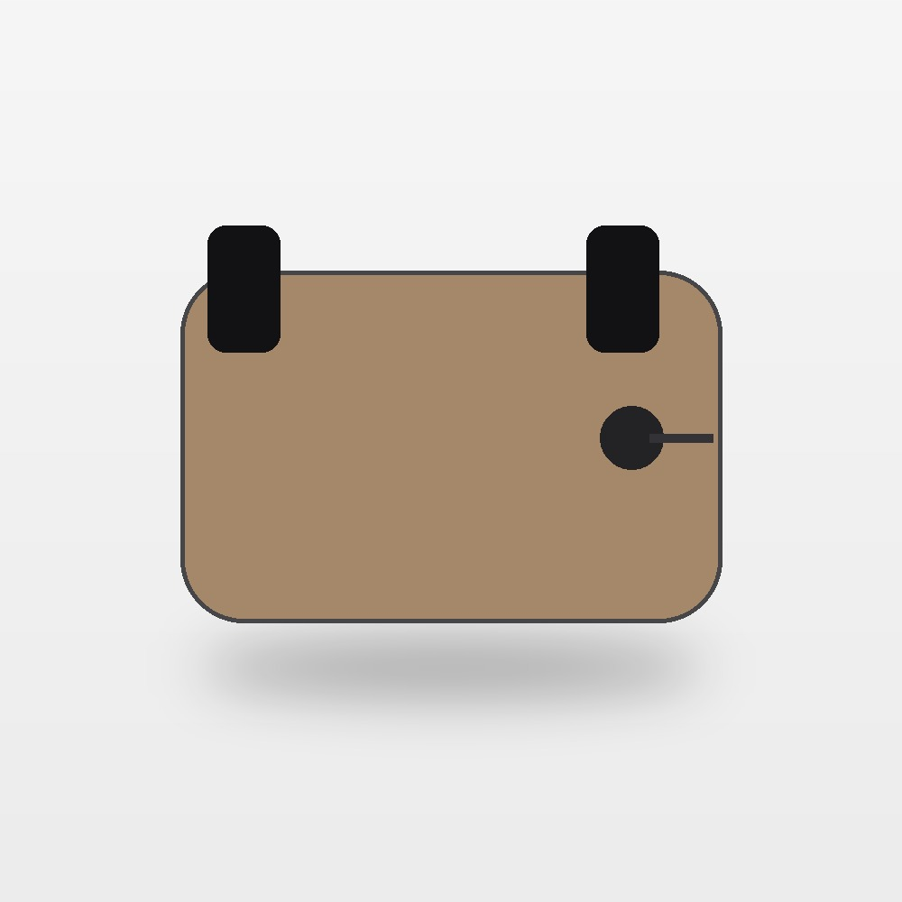
              

              

                
Philips

                <h3 class="card__title"><a href="product-details.html?product=2-slice-pop-up-toaster">2-Slice Pop-Up Toaster</a></h3>
                
<i class="fa-solid fa-star"></i><i class="fa-solid fa-star"></i><i class="fa-solid fa-star"></i><i class="fa-solid fa-star"></i><i class="fa-solid fa-star-half-stroke"></i>

                
₹2,499

                
In Stock

              

            

            

              

                
                

                  <button aria-label="Add to wishlist"><i class="fa-regular fa-heart"></i></button>
                  <button aria-label="Quick view"><i class="fa-solid fa-eye"></i></button>
                

                
              

              

                
Morphy Richards

                <h3 class="card__title"><a href="product-details.html?product=4-slice-wide-slot-toaster">4-Slice Wide Slot Toaster</a></h3>
                
<i class="fa-solid fa-star"></i><i class="fa-solid fa-star"></i><i class="fa-solid fa-star"></i><i class="fa-solid fa-star"></i><i class="fa-regular fa-star"></i>

                
₹4,990

                
In Stock

              

            

            

              

                Bestseller
                

                  <button aria-label="Add to wishlist"><i class="fa-regular fa-heart"></i></button>
                  <button aria-label="Quick view"><i class="fa-solid fa-eye"></i></button>
                

                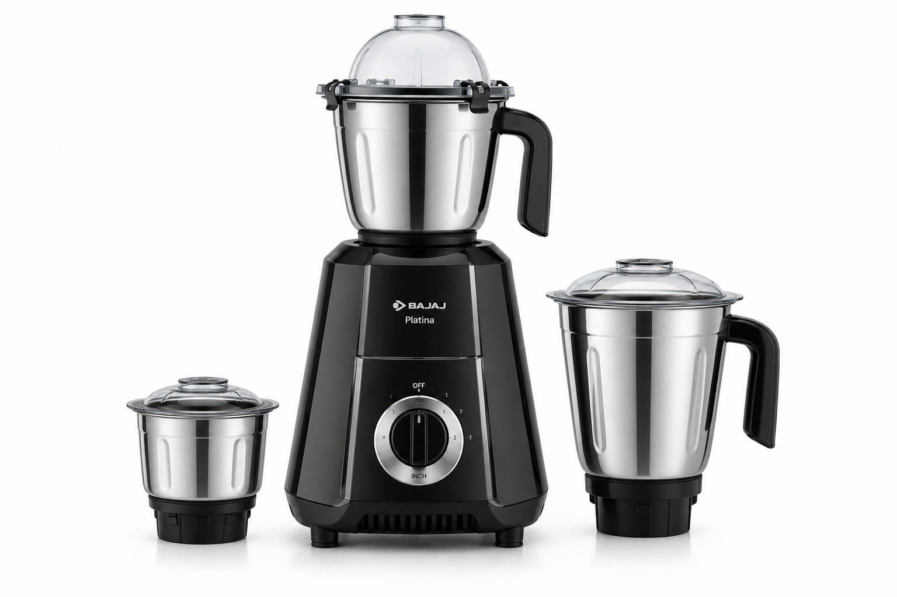
              

              

                
Bajaj

                <h3 class="card__title"><a href="product-details.html?product=750w-mixer-grinder-with-3-jars">750W Mixer Grinder with 3 Jars</a></h3>
                
<i class="fa-solid fa-star"></i><i class="fa-solid fa-star"></i><i class="fa-solid fa-star"></i><i class="fa-solid fa-star"></i><i class="fa-solid fa-star-half-stroke"></i>

                
₹3,499

                
In Stock

              

            

            

              

                
                

                  <button aria-label="Add to wishlist"><i class="fa-regular fa-heart"></i></button>
                  <button aria-label="Quick view"><i class="fa-solid fa-eye"></i></button>
                

                
              

              

                
Bajaj

                <h3 class="card__title"><a href="product-details.html?product=500w-mixer-grinder-3-jar">500W Mixer Grinder 3-Jar</a></h3>
                
<i class="fa-solid fa-star"></i><i class="fa-solid fa-star"></i><i class="fa-solid fa-star"></i><i class="fa-solid fa-star"></i><i class="fa-regular fa-star"></i>

                
₹2,899

                
In Stock

              

            

            

              

                Bestseller
                

                  <button aria-label="Add to wishlist"><i class="fa-regular fa-heart"></i></button>
                  <button aria-label="Quick view"><i class="fa-solid fa-eye"></i></button>
                

                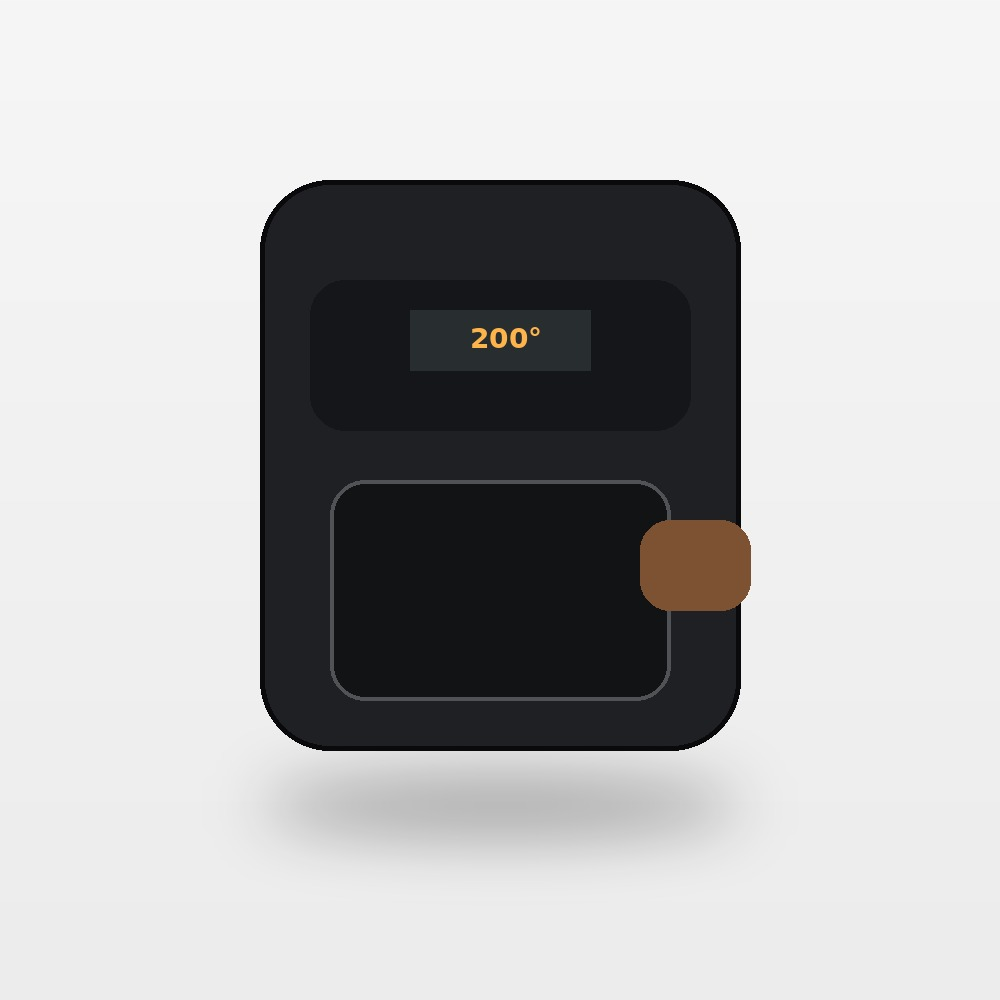
              

              

                
Philips

                <h3 class="card__title"><a href="product-details.html?product=7-3l-premium-digital-air-fryer">7.3L Premium Digital Air Fryer</a></h3>
                
<i class="fa-solid fa-star"></i><i class="fa-solid fa-star"></i><i class="fa-solid fa-star"></i><i class="fa-solid fa-star"></i><i class="fa-solid fa-star-half-stroke"></i>

                
₹14,990

                
In Stock

              

            

            

              

                
                

                  <button aria-label="Add to wishlist"><i class="fa-regular fa-heart"></i></button>
                  <button aria-label="Quick view"><i class="fa-solid fa-eye"></i></button>
                

                
              

              

                
AGARO

                <h3 class="card__title"><a href="product-details.html?product=4-2l-digital-air-fryer">4.2L Digital Air Fryer</a></h3>
                
<i class="fa-solid fa-star"></i><i class="fa-solid fa-star"></i><i class="fa-solid fa-star"></i><i class="fa-solid fa-star"></i><i class="fa-solid fa-star-half-stroke"></i>

                
₹5,499

                
In Stock

              

            

            

              

                
                

                  <button aria-label="Add to wishlist"><i class="fa-regular fa-heart"></i></button>
                  <button aria-label="Quick view"><i class="fa-solid fa-eye"></i></button>
                

                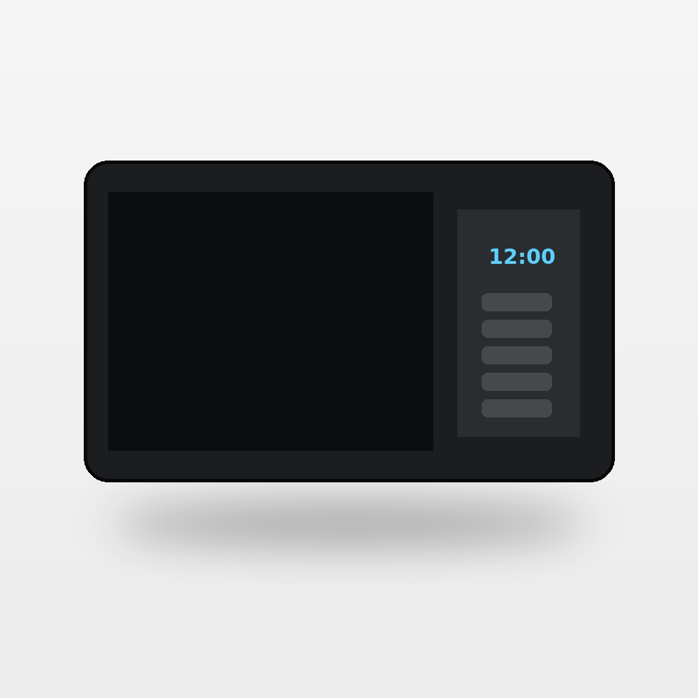
              

              

                
Samsung

                <h3 class="card__title"><a href="product-details.html?product=28l-convection-microwave-oven">28L Convection Microwave Oven</a></h3>
                
<i class="fa-solid fa-star"></i><i class="fa-solid fa-star"></i><i class="fa-solid fa-star"></i><i class="fa-solid fa-star"></i><i class="fa-solid fa-star-half-stroke"></i>

                
₹12,990

                
In Stock

              

            

            

              

                
                

                  <button aria-label="Add to wishlist"><i class="fa-regular fa-heart"></i></button>
                  <button aria-label="Quick view"><i class="fa-solid fa-eye"></i></button>
                

                
              

              

                
LG

                <h3 class="card__title"><a href="product-details.html?product=20l-solo-microwave-oven">20L Solo Microwave Oven</a></h3>
                
<i class="fa-solid fa-star"></i><i class="fa-solid fa-star"></i><i class="fa-solid fa-star"></i><i class="fa-solid fa-star"></i><i class="fa-regular fa-star"></i>

                
₹8,490

                
In Stock

              

            

            

              

                Bestseller
                

                  <button aria-label="Add to wishlist"><i class="fa-regular fa-heart"></i></button>
                  <button aria-label="Quick view"><i class="fa-solid fa-eye"></i></button>
                

                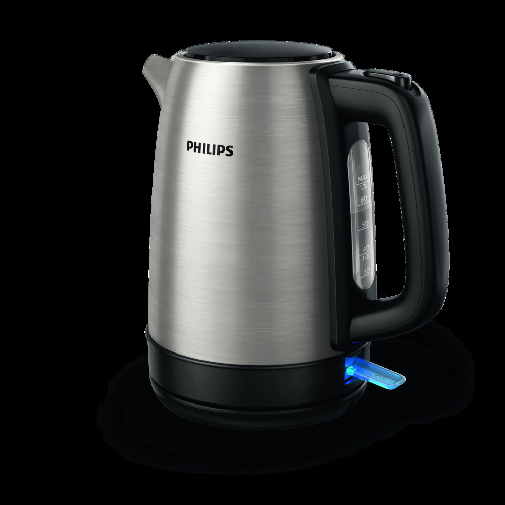
              

              

                
Philips

                <h3 class="card__title"><a href="product-details.html?product=1-7l-stainless-steel-electric-kettle">1.7L Stainless Steel Electric Kettle</a></h3>
                
<i class="fa-solid fa-star"></i><i class="fa-solid fa-star"></i><i class="fa-solid fa-star"></i><i class="fa-solid fa-star"></i><i class="fa-solid fa-star-half-stroke"></i>

                
₹2,799

                
In Stock

              

            

            

              

                
                

                  <button aria-label="Add to wishlist"><i class="fa-regular fa-heart"></i></button>
                  <button aria-label="Quick view"><i class="fa-solid fa-eye"></i></button>
                

                
              

              

                
Prestige

                <h3 class="card__title"><a href="product-details.html?product=1-5l-electric-kettle">1.5L Electric Kettle</a></h3>
                
<i class="fa-solid fa-star"></i><i class="fa-solid fa-star"></i><i class="fa-solid fa-star"></i><i class="fa-solid fa-star"></i><i class="fa-regular fa-star"></i>

                
₹1,499

                
In Stock

              

            

            

              

                
                

                  <button aria-label="Add to wishlist"><i class="fa-regular fa-heart"></i></button>
                  <button aria-label="Quick view"><i class="fa-solid fa-eye"></i></button>
                

                
              

              

                
Bajaj

                <h3 class="card__title"><a href="product-details.html?product=1200mm-bldc-ceiling-fan">1200mm BLDC Ceiling Fan</a></h3>
                
<i class="fa-solid fa-star"></i><i class="fa-solid fa-star"></i><i class="fa-solid fa-star"></i><i class="fa-solid fa-star"></i><i class="fa-solid fa-star-half-stroke"></i>

                
₹3,999

                
In Stock

              

            

            

              

                
                

                  <button aria-label="Add to wishlist"><i class="fa-regular fa-heart"></i></button>
                  <button aria-label="Quick view"><i class="fa-solid fa-eye"></i></button>
                

                
              

              

                
Bajaj

                <h3 class="card__title"><a href="product-details.html?product=tower-fan-with-remote">Tower Fan with Remote</a></h3>
                
<i class="fa-solid fa-star"></i><i class="fa-solid fa-star"></i><i class="fa-solid fa-star"></i><i class="fa-solid fa-star"></i><i class="fa-regular fa-star"></i>

                
₹6,499

                
In Stock

              

            

            

              

                Premium
                

                  <button aria-label="Add to wishlist"><i class="fa-regular fa-heart"></i></button>
                  <button aria-label="Quick view"><i class="fa-solid fa-eye"></i></button>
                

                
              

              

                
Dyson

                <h3 class="card__title"><a href="product-details.html?product=cordless-stick-vacuum-cleaner">Cordless Stick Vacuum Cleaner</a></h3>
                
<i class="fa-solid fa-star"></i><i class="fa-solid fa-star"></i><i class="fa-solid fa-star"></i><i class="fa-solid fa-star"></i><i class="fa-solid fa-star-half-stroke"></i>

                
₹39,990

                
Pre-Order

              

            

            

              

                
                

                  <button aria-label="Add to wishlist"><i class="fa-regular fa-heart"></i></button>
                  <button aria-label="Quick view"><i class="fa-solid fa-eye"></i></button>
                

                
              

              

                
Xiaomi

                <h3 class="card__title"><a href="product-details.html?product=smart-air-purifier-4">Smart Air Purifier 4</a></h3>
                
<i class="fa-solid fa-star"></i><i class="fa-solid fa-star"></i><i class="fa-solid fa-star"></i><i class="fa-solid fa-star"></i><i class="fa-solid fa-star-half-stroke"></i>

                
₹11,999

                
In Stock

              

            

            

              

                
                

                  <button aria-label="Add to wishlist"><i class="fa-regular fa-heart"></i></button>
                  <button aria-label="Quick view"><i class="fa-solid fa-eye"></i></button>
                

                
              

              

                
Philips

                <h3 class="card__title"><a href="product-details.html?product=dry-iron-1000w">Dry Iron 1000W</a></h3>
                
<i class="fa-solid fa-star"></i><i class="fa-solid fa-star"></i><i class="fa-solid fa-star"></i><i class="fa-solid fa-star"></i><i class="fa-regular fa-star"></i>

                
₹1,299

                
In Stock

              

            

            

              

                
                

                  <button aria-label="Add to wishlist"><i class="fa-regular fa-heart"></i></button>
                  <button aria-label="Quick view"><i class="fa-solid fa-eye"></i></button>
                

                
              

              

                
Bajaj

                <h3 class="card__title"><a href="product-details.html?product=instant-water-heater-15l">Instant Water Heater 15L</a></h3>
                
<i class="fa-solid fa-star"></i><i class="fa-solid fa-star"></i><i class="fa-solid fa-star"></i><i class="fa-solid fa-star"></i><i class="fa-regular fa-star"></i>

                
₹9,990

                
In Stock

              

            

            

              

                
                

                  <button aria-label="Add to wishlist"><i class="fa-regular fa-heart"></i></button>
                  <button aria-label="Quick view"><i class="fa-solid fa-eye"></i></button>
                

                
              

              

                
Morphy Richards

                <h3 class="card__title"><a href="product-details.html?product=otg-oven-28l">OTG Oven 28L</a></h3>
                
<i class="fa-solid fa-star"></i><i class="fa-solid fa-star"></i><i class="fa-solid fa-star"></i><i class="fa-solid fa-star"></i><i class="fa-solid fa-star-half-stroke"></i>

                
₹8,990

                
In Stock

              

            

            

              

                Bestseller
                

                  <button aria-label="Add to wishlist"><i class="fa-regular fa-heart"></i></button>
                  <button aria-label="Quick view"><i class="fa-solid fa-eye"></i></button>
                

                
              

              

                
Apple

                <h3 class="card__title"><a href="product-details.html?product=macbook-air-13-inch-m4">MacBook Air 13-inch M4</a></h3>
                
<i class="fa-solid fa-star"></i><i class="fa-solid fa-star"></i><i class="fa-solid fa-star"></i><i class="fa-solid fa-star"></i><i class="fa-solid fa-star-half-stroke"></i>

                
₹99,900

                
In Stock

              

            

            

              

                New
                

                  <button aria-label="Add to wishlist"><i class="fa-regular fa-heart"></i></button>
                  <button aria-label="Quick view"><i class="fa-solid fa-eye"></i></button>
                

                
              

              

                
Samsung

                <h3 class="card__title"><a href="product-details.html?product=galaxy-book5-pro-14-inch">Galaxy Book5 Pro 14-inch</a></h3>
                
<i class="fa-solid fa-star"></i><i class="fa-solid fa-star"></i><i class="fa-solid fa-star"></i><i class="fa-solid fa-star"></i><i class="fa-solid fa-star-half-stroke"></i>

                
₹1,14,990

                
Pre-Order

              

            

            

              

                
                

                  <button aria-label="Add to wishlist"><i class="fa-regular fa-heart"></i></button>
                  <button aria-label="Quick view"><i class="fa-solid fa-eye"></i></button>
                

                
              

              

                
Samsung

                <h3 class="card__title"><a href="product-details.html?product=galaxy-tab-s10-12-4-inch">Galaxy Tab S10+ 12.4-inch</a></h3>
                
<i class="fa-solid fa-star"></i><i class="fa-solid fa-star"></i><i class="fa-solid fa-star"></i><i class="fa-solid fa-star"></i><i class="fa-solid fa-star-half-stroke"></i>

                
₹84,999

                
In Stock

              

            

            

              

                Bestseller
                

                  <button aria-label="Add to wishlist"><i class="fa-regular fa-heart"></i></button>
                  <button aria-label="Quick view"><i class="fa-solid fa-eye"></i></button>
                

                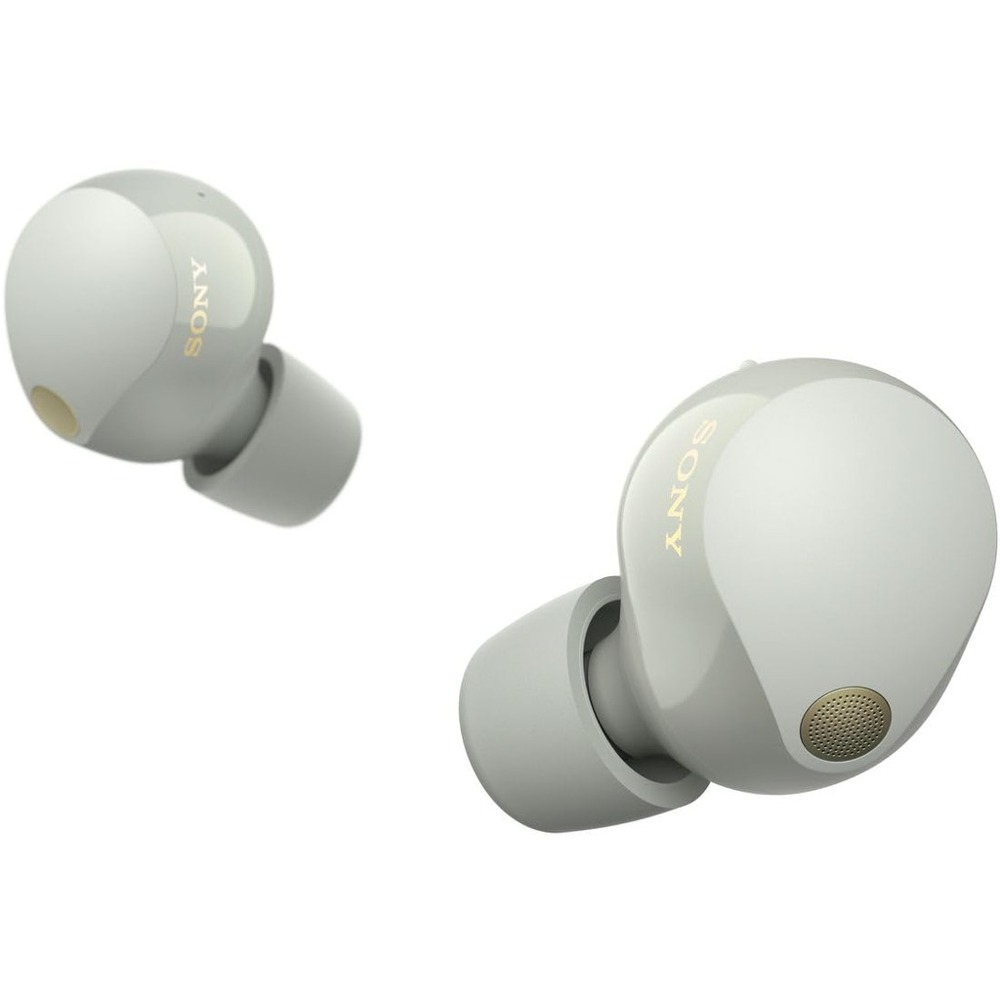
              

              

                
Sony

                <h3 class="card__title"><a href="product-details.html?product=wf-1000xm5-noise-cancelling-earbuds">WF-1000XM5 Noise Cancelling Earbuds</a></h3>
                
<i class="fa-solid fa-star"></i><i class="fa-solid fa-star"></i><i class="fa-solid fa-star"></i><i class="fa-solid fa-star"></i><i class="fa-solid fa-star-half-stroke"></i>

                
₹24,990

                
In Stock

              

            

            

              

                
                

                  <button aria-label="Add to wishlist"><i class="fa-regular fa-heart"></i></button>
                  <button aria-label="Quick view"><i class="fa-solid fa-eye"></i></button>
                

                
              

              

                
Sony

                <h3 class="card__title"><a href="product-details.html?product=wh-1000xm5-wireless-headphones">WH-1000XM5 Wireless Headphones</a></h3>
                
<i class="fa-solid fa-star"></i><i class="fa-solid fa-star"></i><i class="fa-solid fa-star"></i><i class="fa-solid fa-star"></i><i class="fa-solid fa-star-half-stroke"></i>

                
₹29,990

                
In Stock

              

            

            

              

                New
                

                  <button aria-label="Add to wishlist"><i class="fa-regular fa-heart"></i></button>
                  <button aria-label="Quick view"><i class="fa-solid fa-eye"></i></button>
                

                
              

              

                
Samsung

                <h3 class="card__title"><a href="product-details.html?product=galaxy-watch-ultra-2">Galaxy Watch Ultra 2</a></h3>
                
<i class="fa-solid fa-star"></i><i class="fa-solid fa-star"></i><i class="fa-solid fa-star"></i><i class="fa-solid fa-star"></i><i class="fa-solid fa-star-half-stroke"></i>

                
₹59,999

                
Pre-Order

              

            

            

              

                
                

                  <button aria-label="Add to wishlist"><i class="fa-regular fa-heart"></i></button>
                  <button aria-label="Quick view"><i class="fa-solid fa-eye"></i></button>
                

                
              

              

                
JBL

                <h3 class="card__title"><a href="product-details.html?product=portable-40w-bluetooth-speaker">Portable 40W Bluetooth Speaker</a></h3>
                
<i class="fa-solid fa-star"></i><i class="fa-solid fa-star"></i><i class="fa-solid fa-star"></i><i class="fa-solid fa-star"></i><i class="fa-solid fa-star-half-stroke"></i>

                
₹7,999

                
In Stock

              

            

            

              

                
                

                  <button aria-label="Add to wishlist"><i class="fa-regular fa-heart"></i></button>
                  <button aria-label="Quick view"><i class="fa-solid fa-eye"></i></button>
                

                
              

              

                
GoPro

                <h3 class="card__title"><a href="product-details.html?product=4k-action-camera">4K Action Camera</a></h3>
                
<i class="fa-solid fa-star"></i><i class="fa-solid fa-star"></i><i class="fa-solid fa-star"></i><i class="fa-solid fa-star"></i><i class="fa-solid fa-star-half-stroke"></i>

                
₹35,990

                
In Stock

              

            

            <!-- ===== Added: Mobile Phones ===== -->
            

              

                
                

                  <button aria-label="Add to wishlist"><i class="fa-regular fa-heart"></i></button>
                  <button aria-label="Quick view"><i class="fa-solid fa-eye"></i></button>
                

                
              

              

                
Google

                <h3 class="card__title"><a href="product-details.html?product=pixel-9a-5g-128gb">Pixel 9a 5G (128GB)</a></h3>
                
<i class="fa-solid fa-star"></i><i class="fa-solid fa-star"></i><i class="fa-solid fa-star"></i><i class="fa-solid fa-star"></i><i class="fa-solid fa-star-half-stroke"></i>

                
₹49,999

                
In Stock

              

            

            

              

                
                

                  <button aria-label="Add to wishlist"><i class="fa-regular fa-heart"></i></button>
                  <button aria-label="Quick view"><i class="fa-solid fa-eye"></i></button>
                

                
              

              

                
Realme

                <h3 class="card__title"><a href="product-details.html?product=realme-14-pro-plus-5g-256gb">Realme 14 Pro+ 5G (256GB)</a></h3>
                
<i class="fa-solid fa-star"></i><i class="fa-solid fa-star"></i><i class="fa-solid fa-star"></i><i class="fa-solid fa-star"></i><i class="fa-regular fa-star"></i>

                
₹27,999

                
In Stock

              

            

            

              

                
                

                  <button aria-label="Add to wishlist"><i class="fa-regular fa-heart"></i></button>
                  <button aria-label="Quick view"><i class="fa-solid fa-eye"></i></button>
                

                
              

              

                
POCO

                <h3 class="card__title"><a href="product-details.html?product=poco-x7-pro-5g-256gb">POCO X7 Pro 5G (256GB)</a></h3>
                
<i class="fa-solid fa-star"></i><i class="fa-solid fa-star"></i><i class="fa-solid fa-star"></i><i class="fa-solid fa-star"></i><i class="fa-regular fa-star"></i>

                
₹24,999

                
In Stock

              

            

            

              

                New
                

                  <button aria-label="Add to wishlist"><i class="fa-regular fa-heart"></i></button>
                  <button aria-label="Quick view"><i class="fa-solid fa-eye"></i></button>
                

                
              

              

                
Nothing

                <h3 class="card__title"><a href="product-details.html?product=nothing-phone-3a-5g-128gb">Nothing Phone (3a) 5G (128GB)</a></h3>
                
<i class="fa-solid fa-star"></i><i class="fa-solid fa-star"></i><i class="fa-solid fa-star"></i><i class="fa-solid fa-star"></i><i class="fa-solid fa-star-half-stroke"></i>

                
₹25,999

                
In Stock

              

            

            

              

                
                

                  <button aria-label="Add to wishlist"><i class="fa-regular fa-heart"></i></button>
                  <button aria-label="Quick view"><i class="fa-solid fa-eye"></i></button>
                

                
              

              

                
Honor

                <h3 class="card__title"><a href="product-details.html?product=honor-magic-7-pro-5g-512gb">Honor Magic 7 Pro 5G (512GB)</a></h3>
                
<i class="fa-solid fa-star"></i><i class="fa-solid fa-star"></i><i class="fa-solid fa-star"></i><i class="fa-solid fa-star"></i><i class="fa-solid fa-star-half-stroke"></i>

                
₹74,999

                
In Stock

              

            

            <!-- ===== Added: Air Conditioners ===== -->
            

              

                
                

                  <button aria-label="Add to wishlist"><i class="fa-regular fa-heart"></i></button>
                  <button aria-label="Quick view"><i class="fa-solid fa-eye"></i></button>
                

                
              

              

                
Voltas

                <h3 class="card__title"><a href="product-details.html?product=voltas-1-5-ton-3-star-split-ac">1.5 Ton 3-Star Fixed Speed Split AC</a></h3>
                
<i class="fa-solid fa-star"></i><i class="fa-solid fa-star"></i><i class="fa-solid fa-star"></i><i class="fa-solid fa-star"></i><i class="fa-regular fa-star"></i>

                
₹32,990

                
In Stock

              

            

            

              

                Bestseller
                

                  <button aria-label="Add to wishlist"><i class="fa-regular fa-heart"></i></button>
                  <button aria-label="Quick view"><i class="fa-solid fa-eye"></i></button>
                

                
              

              

                
Daikin

                <h3 class="card__title"><a href="product-details.html?product=daikin-1-ton-5-star-inverter-split-ac">1 Ton 5-Star Inverter Split AC</a></h3>
                
<i class="fa-solid fa-star"></i><i class="fa-solid fa-star"></i><i class="fa-solid fa-star"></i><i class="fa-solid fa-star"></i><i class="fa-solid fa-star-half-stroke"></i>

                
₹36,490

                
In Stock

              

            

            

              

                
                

                  <button aria-label="Add to wishlist"><i class="fa-regular fa-heart"></i></button>
                  <button aria-label="Quick view"><i class="fa-solid fa-eye"></i></button>
                

                
              

              

                
Blue Star

                <h3 class="card__title"><a href="product-details.html?product=blue-star-2-ton-3-star-split-ac">2 Ton 3-Star Split AC</a></h3>
                
<i class="fa-solid fa-star"></i><i class="fa-solid fa-star"></i><i class="fa-solid fa-star"></i><i class="fa-regular fa-star"></i><i class="fa-regular fa-star"></i>

                
₹41,990

                
In Stock

              

            

            

              

                
                

                  <button aria-label="Add to wishlist"><i class="fa-regular fa-heart"></i></button>
                  <button aria-label="Quick view"><i class="fa-solid fa-eye"></i></button>
                

                
              

              

                
Hitachi

                <h3 class="card__title"><a href="product-details.html?product=hitachi-1-5-ton-5-star-inverter-split-ac">1.5 Ton 5-Star Inverter Split AC</a></h3>
                
<i class="fa-solid fa-star"></i><i class="fa-solid fa-star"></i><i class="fa-solid fa-star"></i><i class="fa-solid fa-star"></i><i class="fa-solid fa-star"></i>

                
₹44,990

                
In Stock

              

            

            <!-- ===== Added: Refrigerators ===== -->
            

              

                
                

                  <button aria-label="Add to wishlist"><i class="fa-regular fa-heart"></i></button>
                  <button aria-label="Quick view"><i class="fa-solid fa-eye"></i></button>
                

                
              

              

                
Haier

                <h3 class="card__title"><a href="product-details.html?product=haier-195l-direct-cool-single-door-refrigerator">195L Direct Cool Single Door Refrigerator</a></h3>
                
<i class="fa-solid fa-star"></i><i class="fa-solid fa-star"></i><i class="fa-solid fa-star"></i><i class="fa-solid fa-star"></i><i class="fa-regular fa-star"></i>

                
₹15,990

                
In Stock

              

            

            

              

                Bestseller
                

                  <button aria-label="Add to wishlist"><i class="fa-regular fa-heart"></i></button>
                  <button aria-label="Quick view"><i class="fa-solid fa-eye"></i></button>
                

                
              

              

                
Whirlpool

                <h3 class="card__title"><a href="product-details.html?product=whirlpool-265l-frost-free-double-door-refrigerator">265L Frost Free Double Door Refrigerator</a></h3>
                
<i class="fa-solid fa-star"></i><i class="fa-solid fa-star"></i><i class="fa-solid fa-star"></i><i class="fa-solid fa-star"></i><i class="fa-solid fa-star-half-stroke"></i>

                
₹27,490

                
In Stock

              

            

            

              

                
                

                  <button aria-label="Add to wishlist"><i class="fa-regular fa-heart"></i></button>
                  <button aria-label="Quick view"><i class="fa-solid fa-eye"></i></button>
                

                
              

              

                
Godrej

                <h3 class="card__title"><a href="product-details.html?product=godrej-190l-direct-cool-refrigerator">190L Direct Cool Refrigerator</a></h3>
                
<i class="fa-solid fa-star"></i><i class="fa-solid fa-star"></i><i class="fa-solid fa-star"></i><i class="fa-solid fa-star"></i><i class="fa-regular fa-star"></i>

                
₹14,290

                
In Stock

              

            

            

              

                
                

                  <button aria-label="Add to wishlist"><i class="fa-regular fa-heart"></i></button>
                  <button aria-label="Quick view"><i class="fa-solid fa-eye"></i></button>
                

                
              

              

                
Panasonic

                <h3 class="card__title"><a href="product-details.html?product=panasonic-550l-side-by-side-refrigerator">550L Side-by-Side Refrigerator</a></h3>
                
<i class="fa-solid fa-star"></i><i class="fa-solid fa-star"></i><i class="fa-solid fa-star"></i><i class="fa-solid fa-star"></i><i class="fa-solid fa-star"></i>

                
₹78,990

                
In Stock

              

            

            <!-- ===== Added: Toasters ===== -->
            

              

                
                

                  <button aria-label="Add to wishlist"><i class="fa-regular fa-heart"></i></button>
                  <button aria-label="Quick view"><i class="fa-solid fa-eye"></i></button>
                

                
              

              

                
Bajaj

                <h3 class="card__title"><a href="product-details.html?product=bajaj-2-slice-auto-pop-up-toaster">2-Slice Auto Pop-Up Toaster</a></h3>
                
<i class="fa-solid fa-star"></i><i class="fa-solid fa-star"></i><i class="fa-solid fa-star"></i><i class="fa-solid fa-star"></i><i class="fa-regular fa-star"></i>

                
₹1,699

                
In Stock

              

            

            

              

                
                

                  <button aria-label="Add to wishlist"><i class="fa-regular fa-heart"></i></button>
                  <button aria-label="Quick view"><i class="fa-solid fa-eye"></i></button>
                

                
              

              

                
Prestige

                <h3 class="card__title"><a href="product-details.html?product=prestige-pptpkb-4-slice-toaster">PPTPKB 4-Slice Pop-Up Toaster</a></h3>
                
<i class="fa-solid fa-star"></i><i class="fa-solid fa-star"></i><i class="fa-solid fa-star"></i><i class="fa-solid fa-star"></i><i class="fa-solid fa-star-half-stroke"></i>

                
₹3,299

                
In Stock

              

            

            

              

                
                

                  <button aria-label="Add to wishlist"><i class="fa-regular fa-heart"></i></button>
                  <button aria-label="Quick view"><i class="fa-solid fa-eye"></i></button>
                

                
              

              

                
Usha

                <h3 class="card__title"><a href="product-details.html?product=usha-3320-2-slice-toaster">3320 2-Slice Pop-Up Toaster</a></h3>
                
<i class="fa-solid fa-star"></i><i class="fa-solid fa-star"></i><i class="fa-solid fa-star"></i><i class="fa-regular fa-star"></i><i class="fa-regular fa-star"></i>

                
₹1,449

                
In Stock

              

            

            <!-- ===== Added: Air Fryers ===== -->
            

              

                
                

                  <button aria-label="Add to wishlist"><i class="fa-regular fa-heart"></i></button>
                  <button aria-label="Quick view"><i class="fa-solid fa-eye"></i></button>
                

                
              

              

                
Havells

                <h3 class="card__title"><a href="product-details.html?product=havells-prolife-4-5l-digital-air-fryer">Prolife 4.5L Digital Air Fryer</a></h3>
                
<i class="fa-solid fa-star"></i><i class="fa-solid fa-star"></i><i class="fa-solid fa-star"></i><i class="fa-solid fa-star"></i><i class="fa-solid fa-star-half-stroke"></i>

                
₹6,999

                
In Stock

              

            

            

              

                
                

                  <button aria-label="Add to wishlist"><i class="fa-regular fa-heart"></i></button>
                  <button aria-label="Quick view"><i class="fa-solid fa-eye"></i></button>
                

                
              

              

                
Inalsa

                <h3 class="card__title"><a href="product-details.html?product=inalsa-fry-light-5-5l-air-fryer">Fry Light 5.5L Digital Air Fryer</a></h3>
                
<i class="fa-solid fa-star"></i><i class="fa-solid fa-star"></i><i class="fa-solid fa-star"></i><i class="fa-solid fa-star"></i><i class="fa-regular fa-star"></i>

                
₹5,999

                
In Stock

              

            

            

              

                
                

                  <button aria-label="Add to wishlist"><i class="fa-regular fa-heart"></i></button>
                  <button aria-label="Quick view"><i class="fa-solid fa-eye"></i></button>
                

                
              

              

                
Bajaj

                <h3 class="card__title"><a href="product-details.html?product=bajaj-majesty-af-3-5l-air-fryer">Majesty AF 3.5L Air Fryer</a></h3>
                
<i class="fa-solid fa-star"></i><i class="fa-solid fa-star"></i><i class="fa-solid fa-star"></i><i class="fa-solid fa-star"></i><i class="fa-regular fa-star"></i>

                
₹4,499

                
In Stock

              

            

            <!-- ===== Added: Iron & Press ===== -->
            

              

                Bestseller
                

                  <button aria-label="Add to wishlist"><i class="fa-regular fa-heart"></i></button>
                  <button aria-label="Quick view"><i class="fa-solid fa-eye"></i></button>
                

                
              

              

                
Philips

                <h3 class="card__title"><a href="product-details.html?product=philips-gc2040-steam-iron-1440w">GC2040 Steam Iron 1440W</a></h3>
                
<i class="fa-solid fa-star"></i><i class="fa-solid fa-star"></i><i class="fa-solid fa-star"></i><i class="fa-solid fa-star"></i><i class="fa-solid fa-star-half-stroke"></i>

                
₹1,899

                
In Stock

              

            

            

              

                
                

                  <button aria-label="Add to wishlist"><i class="fa-regular fa-heart"></i></button>
                  <button aria-label="Quick view"><i class="fa-solid fa-eye"></i></button>
                

                
              

              

                
Usha

                <h3 class="card__title"><a href="product-details.html?product=usha-ei-3402-steam-iron">EI 3402 Steam Iron</a></h3>
                
<i class="fa-solid fa-star"></i><i class="fa-solid fa-star"></i><i class="fa-solid fa-star"></i><i class="fa-solid fa-star"></i><i class="fa-regular fa-star"></i>

                
₹1,199

                
In Stock

              

            

            

              

                
                

                  <button aria-label="Add to wishlist"><i class="fa-regular fa-heart"></i></button>
                  <button aria-label="Quick view"><i class="fa-solid fa-eye"></i></button>
                

                
              

              

                
Bajaj

                <h3 class="card__title"><a href="product-details.html?product=bajaj-majesty-dx-7-dry-iron">Majesty DX-7 Dry Iron 1000W</a></h3>
                
<i class="fa-solid fa-star"></i><i class="fa-solid fa-star"></i><i class="fa-solid fa-star"></i><i class="fa-solid fa-star"></i><i class="fa-regular fa-star"></i>

                
₹899

                
In Stock

              

            

            

              

                New
                

                  <button aria-label="Add to wishlist"><i class="fa-regular fa-heart"></i></button>
                  <button aria-label="Quick view"><i class="fa-solid fa-eye"></i></button>
                

                
              

              

                
Havells

                <h3 class="card__title"><a href="product-details.html?product=havells-adorn-cord-free-steam-iron">Adorn Cord-Free Steam Iron</a></h3>
                
<i class="fa-solid fa-star"></i><i class="fa-solid fa-star"></i><i class="fa-solid fa-star"></i><i class="fa-solid fa-star"></i><i class="fa-solid fa-star"></i>

                
₹2,999

                
In Stock

              

            

          

          

            <i class="fa-solid fa-magnifying-glass no-results__icon"></i>
            <h3>No products found</h3>
            
Try adjusting your filters or search term.

          

          <!-- Pagination -->
          <nav class="pagination" data-js="products-pagination" aria-label="Products pagination"></nav>
          
Showing 1–111 of 111 products

        

      

    </section>

  </main>

  <footer class="site-footer">
    

      

        

          
          
Gada Electronics delivers premium electrical and electronic equipment, engineering solutions, and industrial installations across India — powering industries through innovation for over 28 years.

          

            <a href="https://facebook.com/gadaelectronics" aria-label="Facebook" target="_blank" rel="noopener"><i class="fa-brands fa-facebook-f"></i></a>
            <a href="https://linkedin.com/company/gadaelectronics" aria-label="LinkedIn" target="_blank" rel="noopener"><i class="fa-brands fa-linkedin-in"></i></a>
            <a href="https://twitter.com/gadaelectronics" aria-label="Twitter" target="_blank" rel="noopener"><i class="fa-brands fa-x-twitter"></i></a>
            <a href="https://instagram.com/gadaelectronics" aria-label="Instagram" target="_blank" rel="noopener"><i class="fa-brands fa-instagram"></i></a>
            <a href="https://youtube.com/@gadaelectronics" aria-label="YouTube" target="_blank" rel="noopener"><i class="fa-brands fa-youtube"></i></a>
          

        

        

          
Quick Links

          <ul class="footer-col__list">
            <li><a href="about.html">About Us</a></li>
            <li><a href="products.html">Our Products</a></li>
            <li><a href="index.html#consumer-electronics">Consumer Electronics</a></li>
            <li><a href="industries.html">Industries We Serve</a></li>
            <li><a href="services.html">Services &amp; Solutions</a></li>
            <li><a href="projects.html">Projects &amp; Installations</a></li>
            <li><a href="quality.html">Quality Assurance</a></li>
            <li><a href="certifications.html">Certifications</a></li>
          </ul>
        

        

          
Company

          <ul class="footer-col__list">
            <li><a href="careers.html">Careers</a></li>
            <li><a href="contact.html">Contact Us</a></li>
            <li><a href="contact.html#faq">FAQs</a></li>
            <li><a href="assets/docs/company-profile.pdf" target="_blank" rel="noopener">Company Profile (PDF)</a></li>
            <li><a href="404.html">Privacy Policy</a></li>
            <li><a href="404.html">Terms of Service</a></li>
          </ul>
        

        

          
Get In Touch

          
<i class="fa-solid fa-location-dot icon"></i>Plot 45, MIDC Industrial Area, Andheri East, Mumbai, Maharashtra 400093, India

          
<i class="fa-solid fa-phone icon"></i>+91-22-4000-1234

          
<i class="fa-solid fa-envelope icon"></i>info@gadaelectronics.com

          

            
Subscribe to our newsletter

            <form class="footer-newsletter__form" data-js="newsletter-form" novalidate>
              <label for="newsletterEmail" class="u-sr-only">Email address</label>
              <input type="email" id="newsletterEmail" name="email" class="footer-newsletter__input" placeholder="Enter your email" required aria-describedby="newsletterMessage">
              <button type="submit" class="btn btn--primary btn--icon" aria-label="Subscribe"><i class="fa-solid fa-paper-plane"></i></button>
            </form>
            

            <input type="text" name="hp_field" class="u-sr-only" tabindex="-1" autocomplete="off">
          

        

      

      

        
&copy; 2026 Gada Electronics. All rights reserved.

        

          <a href="404.html">Privacy Policy</a>
          <a href="404.html">Terms &amp; Conditions</a>
          <a href="404.html">Sitemap</a>
        

      

    

  </footer>

  <button class="back-to-top" data-js="back-to-top" aria-label="Back to top"><i class="fa-solid fa-arrow-up"></i></button>
  

  
  
  
  
  
</body>
</html>